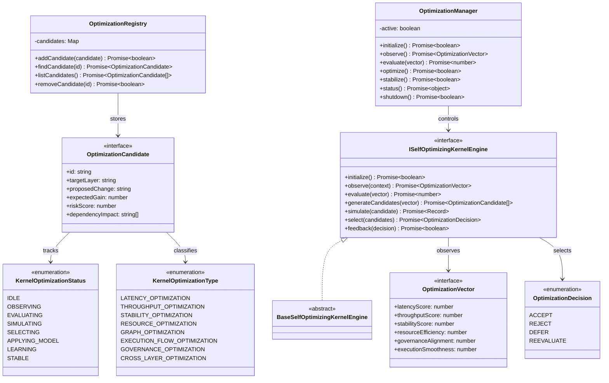

# Self-Optimizing Kernel Loop Specification (自己最適化カーネルループ定義規範)

Version: 1.0.0
Phase: Phase 141 (Autonomous Self-Optimizing Kernel Loop)
Status: Active

---

## 1. 目的 (Purpose)
本仕様書は、AIOS (Artificial Intelligence Operating System) における自己最適化カーネルループの構造・型・契約定義（Blueprint）を規定します。
カーネル自体が「観測（Observe）→ 評価（Evaluate） → 比較（Compare） → 最適化候補生成（Optimize Candidate） → 選択（Select） → フィードバック（Feedback）」の継続的改善ループを自律的に駆動し、システムの遅延、スループット、安定性、およびリソース効率を最善状態に維持・探索するための自己改善（Self-Optimization）モデルを提供します。

---

## 2. 関係性ダイアグラム (Relationship Diagram)



---

## 3. 自己最適化ループモデル (Closed-Loop Optimization Flow)

```
Kernel State ──> Observation ──> Candidate Generation ──> Simulation
                                                             │
                                                             ▼
Kernel State Update <── Feedback <─────────────────────── Selection
```

---

## 4. 最適化ライフサイクル (Optimization Lifecycle)

```
[ IDLE ] ──> [ OBSERVING ] ──> [ EVALUATING ] ──> [ SIMULATING ] ──> [ SELECTING ]
                                                                          │
                                                                          ▼
                                                                     [ APPLYING ]
                                                                     [ LEARNING ]
                                                                     [ STABLE ]
```

---

## 5. 各種統合モデル (Integration Model)

### 5.1 Optimization Score Mapping (スコアリング統合)
Latency, Throughput, Resource などのパフォーマンス評価指標を `OptimizationVector` として総合数値化し、現在のシステム稼働効率を決定論的に評価（`evaluate`）します。

### 5.2 Candidate Generation & Simulation (候補生成と仮想シミュレーション)
* **候補生成**: 最適化ベクトルを元に、パフォーマンス改善の対象・戦略を示す `OptimizationCandidate` を生成します。
* **仮想シミュレーション**: 実環境への適用前に、期待される改善効果（Expected Gain）とリスク（Risk Score）を論理シミュレーション（`simulate`）します。

### 5.3 Feedback Application Constraint
選択された最適化意思決定（`ACCEPT`）は、フィードバックとしてカーネルの状態更新情報（Metadata等）へ記録されますが、実稼働中のランタイムリソースやコードへの動的変更は実行されません（論理定義）。

---

## 6. 将来の統合ロードマップ (Future Roadmap)
* **Fully Autonomous Adaptive Kernel Loop (Phase 142 予定)**: 進化・最適化ループに基づき、自律的にカーネル動作ポリシーやスケジュール戦略を動的かつ安全に変容・適応させる実行レイヤーの結合。
* **Recursive Self-Improving AIOS Core (Phase 143 予定)**: AIOS自体が自身の改善最適化アルゴリズムや判定モデルの再定義を行い、自己帰納的に性能向上を無限試行する再帰的自己修復コア。
