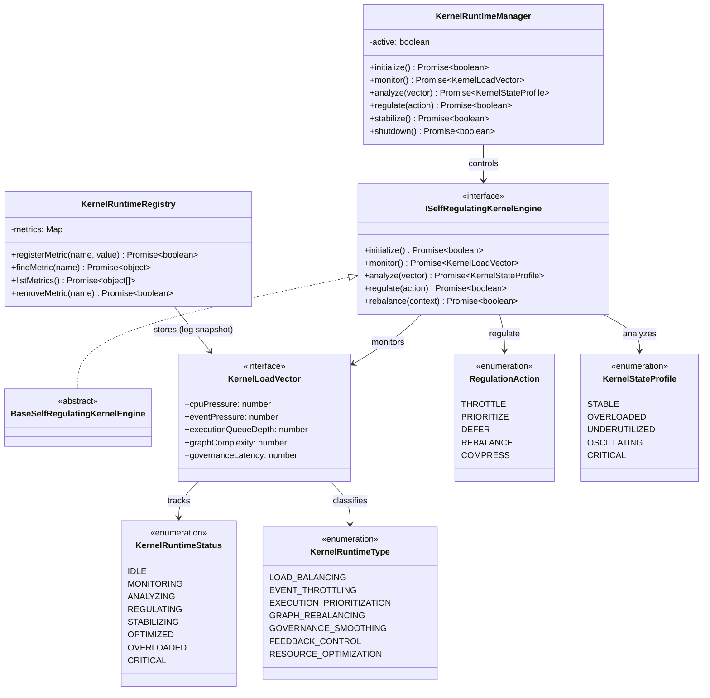

# Self-Regulating Kernel Runtime Specification (自己調整型カーネルランタイム定義規範)

Version: 1.0.0
Phase: Phase 140 (Autonomous Self-Regulating Kernel Runtime)
Status: Active

---

## 1. 目的 (Purpose)
本仕様書は、AIOS (Artificial Intelligence Operating System) における自己調整型カーネルランタイムの構造・型・契約定義（Blueprint）を規定します。
システム全体のイベント流量、実行キュー深度、ガバナンス遅延、グラフ構造変化速度などの「カーネル負荷ベクトル（KernelLoadVector）」をカーネル自身が自律的に評価し、Throttling（スロットリング）や Prioritization（優先度調整）などの調整アクション（RegulationAction）を選択・決定可能な自己調整（Self-Regulation）モデルを提供します。

---

## 2. 関係性ダイアグラム (Relationship Diagram)



---

## 3. 自己調整フィードバックループモデル (Self-Regulation Flow)

```
Event Load ──> Kernel Runtime ──> Regulation Engine ──> Stabilization Layer 
                                                             │
                                                             ▼
System Loop <────────────────────────────────────────── Meta-Governance
```

---

## 4. 状態調整ライフサイクル (Regulation Lifecycle)

```
[ IDLE ] ──> [ MONITORING ] ──> [ ANALYZING ] ──> [ REGULATING ] ──> [ STABILIZING ]
                                                                          │
                                                                          ▼
                                                                     [ OPTIMIZED ]
                                                                     [ OVERLOADED ]
                                                                     [ CRITICAL ]
```

---

## 5. 各種統合モデル (Integration Model)

### 5.1 Dynamic Load Regulation (動的負荷調整)
カーネルランタイムは、CPU・イベントキュー負荷状況を `KernelLoadVector` で統合検知します。過負荷や異常振動がみられる場合、`THROTTLE` や `DEFER` などの制御アクション（RegulationAction）を選択します。

### 5.2 Integration with Stabilization Layer
調整アクションが選択されると、前フェーズで作成された `Feedback Stabilization Engine` と協調し、振動するシグナルを減衰処理します。

### 5.3 Meta-Governance Integration
自己調整によって得られたシステム最適化状態はメタガバナンス（Meta-Governance Layer）でポリシー検証され、稼働パラメータの範囲内で安全に運用されます（論理定義のみ）。

---

## 6. 将来の統合ロードマップ (Future Roadmap)
* **Autonomous Self-Optimizing Kernel Loop (Phase 141 予定)**: 自己調整データをベースに、実行速度の最大化とリソース消費の最小化をリアルタイムで自動シミュレーション・動的チューニングする最適化ループ。
* **Fully Autonomous Closed-Loop AIOS Runtime (Phase 142 予定)**: 外部指示を介さずに、OS自身が負荷・ポリシー・進化目標に基づいて安全自己変容を継続する自律閉ループ実行体。
