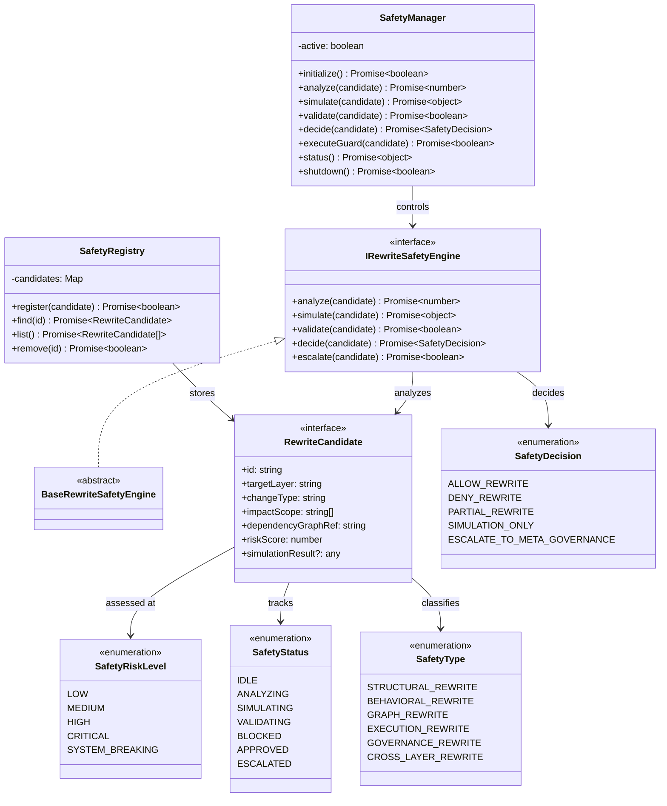

# Self-Rewriting Safety Model Layer Specification (自己書き換え安全性モデル定義規範)

Version: 1.0.0
Phase: Phase 142.6 (Self-Rewriting Safety Model Layer)
Status: Active

---

## 1. 目的 (Purpose)
本仕様書は、AIOS (Artificial Intelligence Operating System) における自己書き換え安全性モデルの構造・型・契約定義（Blueprint）を規定します。
Phase143（Recursive Self-Rewriting Kernel Architecture）に入る直前の最終防壁として、書き換え操作そのものの安全性を構造的に定義し、「書き換えを許可するための構造ルール」を提供します。

---

## 2. 最重要原則：本レイヤーの本質

> ⚠️ Phase142.6 が定義するのは「書き換えを許可するための構造ルール」のみである。

- **❌ 実行しない**: いかなる書き換え処理も実行しない。
- **❌ 判断しない**: アルゴリズムによる動的判断ロジックを含まない。
- **✅ 定義だけする**: 書き換え許可/拒否の構造ルール・型・契約のみを定義する。

この原則が守られることで、Phase143（Self-Rewriting）は安全に成立する。

---

## 3. 3層防御の責務分離（厳守）

| Layer | Phase | 役割 | ディレクトリ | 本質 |
|---|---|---|---|---|
| 評価 | Phase132 | 横断的監査エンジン（事後的・評価型） | `src/audit/` | 「この状態は正しいか？」 |
| 通過制御 | Phase142.5 | 進化操作の事前通過制御（ゲート型） | `src/auditgate/` | 「この変更を通してよいか？」 |
| **書き換え制御** | **Phase142.6** | **書き換え許可の構造ルール定義** | **`src/safety/`** | **「この書き換えは安全か？」** |

### Phase142.6 と Phase143 の境界（絶対不可侵）

| 項目 | Phase142.6 (Safety Model) | Phase143 (Self-Rewriting) |
|---|---|---|
| **役割** | 安全判断レイヤー（構造ルール定義） | 構造変更レイヤー（書き換え構造定義） |
| **定義対象** | 許可/拒否のルール・リスクレベル・制約 | 書き換え操作の実行モデル・パイプライン |
| **実行** | なし（定義のみ） | なし（Blueprint） |

---

## 4. 関係性ダイアグラム (Relationship Diagram)



---

## 5. 安全性判定フローモデル (Safety Flow)

```
Rewrite Request
   ↓
Safety Analysis (構造破壊検知)
   ↓
Impact Simulation (未来影響予測)
   ↓
Constraint Validation (制約照合)
   ↓
Safety Decision (許可/拒否/縮小)
   ↓
Governance Escalation (必要時)
```

---

## 6. 全体フロー（3層防御 + 書き換え）

```
Rewrite Request
   ↓
Phase142.6: Safety Model (書き換え安全性ルール照合)
   ↓
Phase142.5: Audit Gate (進化通過制御)
   ↓
Phase132: Audit Layer (横断監査評価)
   ↓
Governance Kernel Approval
   ↓
Phase143: Self-Rewriting (構造変更定義) ← 次フェーズ
```
