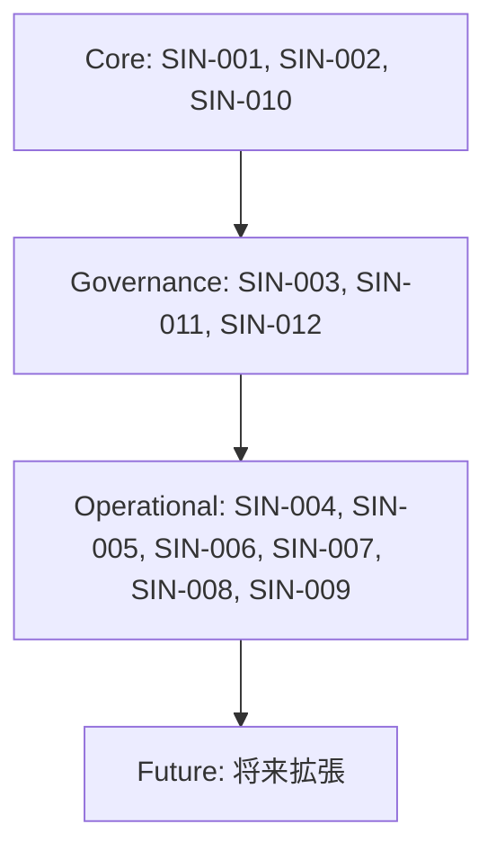
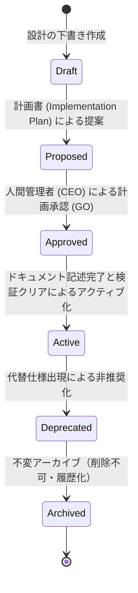

# AIOS Specification Index (仕様書インデックス・相互参照定義規範)

Version: 1.0.0
Phase: Phase 113 (Specification Index Foundation)
Status: Active

---

## 1. 目的 (Purpose)
本仕様書は、AIOS (Artificial Intelligence Operating System) を構成するすべての仕様定義書（Specifications）を一元管理し、仕様間の依存ネットワーク、相互参照（Cross-Reference）、バージョン管理ポリシー、および参照ナビゲーションルールを規定することで、人間および開発AIが決定論的かつ正確に仕様を参照できる基盤を提供します。

---

## 2. 仕様書インデックス番号 (Specification Index Number: SIN)
すべての仕様書には、永続的な一意の識別番号（SIN）が割り当てられます。

| SIN | 仕様書名 (Specification Name) | 主な役割 (Primary Role) |
|---|---|---|
| `SIN-001` | [DevelopmentOS.md](file:///Volumes/SSD_DATA/posting-map-system/docs/specifications/DevelopmentOS.md) | 開発ライフサイクル・基本原則の規定 |
| `SIN-002` | [AuditOS.md](file:///Volumes/SSD_DATA/posting-map-system/docs/specifications/AuditOS.md) | 品質監査原則・監査エンジンの規定 |
| `SIN-003` | [RuleRegistry.md](file:///Volumes/SSD_DATA/posting-map-system/docs/specifications/RuleRegistry.md) | 監査コアルール・重大度の定義カタログ |
| `SIN-004` | [IncidentRegistry.md](file:///Volumes/SSD_DATA/posting-map-system/docs/specifications/IncidentRegistry.md) | 例外・不整合インシデントおよびRCAの規定 |
| `SIN-005` | [PreventiveGate.md](file:///Volumes/SSD_DATA/posting-map-system/docs/specifications/PreventiveGate.md) | 実装前の予防的チェックとアドバイザリの規定 |
| `SIN-006` | [AuditHistory.md](file:///Volumes/SSD_DATA/posting-map-system/docs/specifications/AuditHistory.md) | 不変の監査ログ・証跡レコードの規定 |
| `SIN-007` | [QualityMetrics.md](file:///Volumes/SSD_DATA/posting-map-system/docs/specifications/QualityMetrics.md) | 品質およびプロセス適合率メトリクス定義 |
| `SIN-008` | [KnowledgeBase.md](file:///Volumes/SSD_DATA/posting-map-system/docs/specifications/KnowledgeBase.md) | 組織ナレッジ・教訓・学習の規定 |
| `SIN-009` | [AuditDashboard.md](file:///Volumes/SSD_DATA/posting-map-system/docs/specifications/AuditDashboard.md) | ガバナンス・ヘルス可視化表示の規定 |
| `SIN-010` | [DataDictionary.md](file:///Volumes/SSD_DATA/posting-map-system/docs/specifications/DataDictionary.md) | 共通用語・ID体系・状態・レベルの辞書定義 |
| `SIN-011` | [DecisionModel.md](file:///Volumes/SSD_DATA/posting-map-system/docs/specifications/DecisionModel.md) | 意思決定フローおよびレコード構造の規定 |
| `SIN-012` | [IdentityRoleModel.md](file:///Volumes/SSD_DATA/posting-map-system/docs/specifications/IdentityRoleModel.md) | アクター権限・責任・信頼レベルの規定 |
| `SIN-013` | [SpecificationIndex.md](file:///Volumes/SSD_DATA/posting-map-system/docs/specifications/SpecificationIndex.md) | 本仕様書（仕様書マスターインデックス） |

---

## 3. 仕様書カタログ (Specification Catalog)

### 3.1 依存レベル分類 (Specification Dependency Levels)
各仕様書は、その依存度の高さと重要性に応じて以下のレベルに分類されます。

* **`Core` (中核仕様)**:
  * AIOSの最も基礎となるデータ、監査、開発プロセスそのものを定義する。
  * *対象*: `SIN-001` (DevelopmentOS), `SIN-002` (AuditOS), `SIN-010` (DataDictionary).
* **`Governance` (統治仕様)**:
  * 開発者やAIエージェントの権限、承認プロセス、およびコアルールを制御する。
  * *対象*: `SIN-003` (RuleRegistry), `SIN-011` (DecisionModel), `SIN-012` (IdentityRoleModel).
* **`Operational` (運用・分析仕様)**:
  * システムの過去履歴、分析、および教訓の蓄積を制御する。
  * *対象*: `SIN-004` (IncidentRegistry), `SIN-005` (PreventiveGate), `SIN-006` (AuditHistory), `SIN-007` (QualityMetrics), `SIN-008` (KnowledgeBase), `SIN-009` (AuditDashboard).
* **`Future` (拡張仕様)**:
  * 将来追加されるレビュー自動化やオーケストレーションの機能拡張を制御する。

---

## 4. 依存マップ & 相互参照マトリクス (Dependency & Cross Reference)

### 4.1 仕様依存関係マップ (Dependency Map)



### 4.2 相互参照マトリクス (Cross Reference Matrix)
各コンポーネントが直接的に依存・参照している仕様のネットワーク。

* `DevelopmentOS` (SIN-001) ──> `AuditOS` (SIN-002)
* `AuditOS` (SIN-002) ──> `Rule Registry` (SIN-003)
* `Rule Registry` (SIN-003) ──> `Incident Registry` (SIN-004)
* `Incident Registry` (SIN-004) ──> `Preventive Gate` (SIN-005)
* `Preventive Gate` (SIN-005) ──> `Decision Model` (SIN-011)
* `Decision Model` (SIN-011) ──> `Identity & Role Model` (SIN-012)
* `Audit History` (SIN-006) ──> `Quality Metrics` (SIN-007)
* `Quality Metrics` (SIN-007) ──> `Audit Dashboard` (SIN-009)
* `Knowledge Base` (SIN-008) ──> `Audit Dashboard` (SIN-009)
* `Specification Index` (SIN-013) ──> すべての SIN 仕様書

---

## 5. 仕様書ライフサイクル (Specification Lifecycle)



---

## 6. バージョン管理ポリシー (Version Policy)
すべての仕様書はセマンティックバージョニング形式（`Major.Minor.Patch`）で管理されます。

* **Major (X.0.0)**:
  * 意思決定や権限、データ辞書の共通列挙型など、後方互換性を破壊する重大なアーキテクチャ変更時にインクリメント。
* **Minor (X.Y.0)**:
  * 新しい仕様ウィジェット、新規コアルール、新しいメタデータフィールドなどの後方互換性のある機能追加時にインクリメント。
* **Patch (X.Y.Z)**:
  * タイポ修正、説明の明文化、Mermaid図の軽微な修正時にインクリメント。
* *注意*: すべてのバージョン更新は、コミット時のキャッシュバスター更新ルールと同期されなければなりません。

---

## 7. 開発フェーズマッピング (Phase Mapping)

| フェーズ | SIN | 成果物仕様書 | 主なコミット・変更ハッシュ |
|---|---|---|---|
| `Phase101` | `SIN-001` | DevelopmentOS.md | `c841224f8dcf677685a535bfd7ff8f6dafa5a9b9` |
| `Phase102` | `SIN-002` | AuditOS.md | `ae79f4ea576884067cfc0cc6203cf3d7dfd56715` |
| `Phase103` | `SIN-003` | RuleRegistry.md | `89259cefcfc436b7012543e49e0cd58957bf242c` |
| `Phase104` | `SIN-004` | IncidentRegistry.md | `24d7504f6e6cdb38740cda320f78cc9bc37f00e5` |
| `Phase105` | `SIN-005` | PreventiveGate.md | `15ee99fe1e5fbdb0688a44faea33c690ea39c4d9` |
| `Phase106` | `SIN-006` | AuditHistory.md | `b9294680e6c6e7a2b9f67a21f7db1f948bf81dbf` |
| `Phase107` | `SIN-007` | QualityMetrics.md | `d5c826dddb7ea05c7540265f299d63c58b438f38` |
| `Phase108` | `SIN-008` | KnowledgeBase.md | `ef200418c39cfc1a01c45df07e49e29a9ee3ea76` |
| `Phase109` | `SIN-009` | AuditDashboard.md | `7ea7f422998a44b9319e71e21b790d96d9ccca30` |
| `Phase110` | `SIN-010` | DataDictionary.md | `abe0e7cf23927d6d5ef66432098679ea2b8bbd23` |
| `Phase111` | `SIN-011` | DecisionModel.md | `6c2bcacd1fbc9c09c25bbbfef19eb0b106f0b4d4` |
| `Phase112` | `SIN-012` | IdentityRoleModel.md | `b95febfe8f4a13229b4fa4ab4e4b52479e0a05a8` |
| `Phase113` | `SIN-013` | SpecificationIndex.md | 本仕様コミット |

---

## 8. 仕様参照ナビゲーションルール (Navigation Rules)
開発AIおよび人間は、仕様変更や実装の検討を行う際、以下の解決順序に従ってドキュメントを参照しなければなりません。

```
1. Specification Index (SIN-013) : 全体の関係・依存性を評価
        │
        ▼
2. Data Dictionary (SIN-010)     : 共通用語およびスキーマキーの確認
        │
        ▼
3. Decision Model (SIN-011)      : 意思決定プロセスと権限の確認
        │
        ▼
4. 各個別仕様書 (SIN-001〜SIN-012): 具現化領域のルールを確認
```

---

## 9. 将来の自動化ロードマップ (Future Roadmap)
* **自動ロードと一貫性バリデーション (tools/specifications/specification_index.json)**:
  将来的に、すべての仕様の SIN、ファイルパス、および依存関係は `specification_index.json` にエクスポートされます。CIE Auditor は、新規仕様書追加時に本インデックスへの登録漏れがないか、あるいは仕様書間で循環依存が発生していないかを AST/依存グラフ解析によって自動検証するチェックを配備します。
