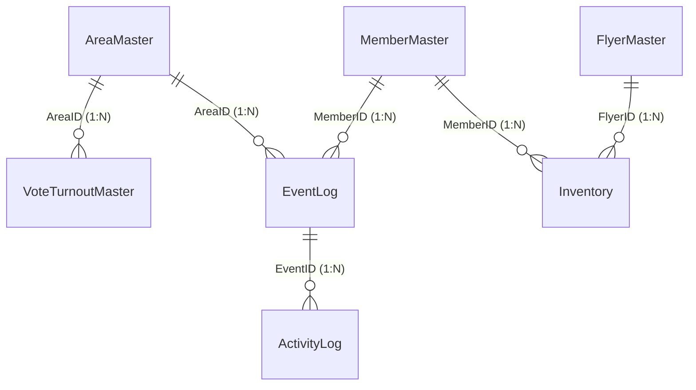

# Spreadsheet Architecture Specification (SaaS Product Version 1.0)

## 1. 目的 (Purpose)
POSTING MAP 商品版の唯一の正（SSOT: Single Source of Truth）となる Google Spreadsheet のアーキテクチャ、テーブル設計、リレーション、データフロー、およびガバナンスルールを定義する。

---

## 2. システム連携における SSOT 原則 (SSOT Rules)
- **唯一の正 (Single Source of Truth)**:
  - Google Spreadsheet は POSTING MAP における唯一の正であり、すべての実績イベントおよび静的マスター情報はスプレッドシート上のデータを正とする。
  - Webダッシュボード、配布員アプリ（Hアプリ）、Google Apps Script (GAS) API、および AIOS は、すべて本仕様書で定義されたスプレッドシート構造に基づいて動作しなければならない。
- **データ更新ルール**:
  - 実績データ（配布完了、写真、GPS等）の追加・変更は、直接セルを上書き・編集するのではなく、必ず EventLog へのイベント追記（appendRow）として追加されなければならない。
  - 個別の地区シートは、EventLog の実績を反映させるためのキャッシュシャドウライト（複製書き込み）のみを許容する。

---

## 3. 全体構成およびデータリレーション (Spreadsheet Topology)

---

## 4. 各シートの責務定義 (Sheet Responsibilities)

### 4.1. AreaMaster (地区マスタ)
- **役割**: 配布対象となる各地区ブロック（エリア）の基本定義。目標世帯数や地理的な代表座標を管理する。
- **作成元**: 管理者 (初期インポート/CSVアップロード)
- **更新元**: 管理者 (管理画面)
- **利用画面**: Hアプリ (エリア選択リスト), ダッシュボード (全体進捗表示, マップ)

### 4.2. VoteTurnoutMaster (地区別国政選挙投票率履歴マスタ)
- **役割**: 地区ごとの過去3回の国政選挙（衆議院・参議院）の投票率データを保持し、全国平均等の比較用データを提供する。
- **作成元**: 管理者 (選挙後のデータ登録)
- **更新元**: 管理者 (手動登録/インポート)
- **利用画面**: ダッシュボード (選挙分析画面、ヒートマップ表示)
- **制約**:
  - 本マスタのデータは「閲覧・分析・視覚化」の支援に限定して使用される。
  - AIOS やシステムが本データから配布の「優先順位」を自動算出して強制的な配布指示を行ってはならない。

### 4.3. MemberMaster (名簿・管理者IDマスタ)
- **役割**: 配布スタッフおよび管理者のマスタデータ。LINEユーザーIDとの紐付けを保持し、認証の解決に使用する。
- **作成元**: システム (スタッフ/管理者新規登録 API)
- **更新元**: システム (LINE UserID連携更新時), 管理者 (手動編集)
- **利用画面**: Hアプリ (ログイン認証/選択), ダッシュボード (権限解決)

### 4.4. FlyerMaster (チラシマスタ)
- **役割**: 配布対象となる各種チラシ・資材のマスター定義。
- **作成元**: 管理者 (ダッシュボード)
- **更新元**: 管理者 (ダッシュボード)
- **利用画面**: 配布員アプリ (在庫報告), ダッシュボード (資材管理)

### 4.5. Inventory (チラシ在庫・保管庫マスタ)
- **役割**: 各配布拠点および配布員の手元にある各チラシの現在庫状況および移動（受け渡し）要請の管理。
- **作成元**: システム (在庫初期化時 / 受け渡し要請登録時)
- **更新元**: システム (受け渡し承認時 / 在庫直接更新時)
- **利用画面**: Hアプリ (受け渡し要請, 在庫確認), ダッシュボード (在庫推移, 承認画面)

### 4.6. EventLog (実績イベントログ) - 最重要
- **役割**: 配布完了、GPS記録、写真登録、在庫変化、Hアプリ操作など、システム内で発生したすべての実績イベントをタイムスタンプ順に時系列記録する唯一のログ（SSOT）。将来的な AIOS 接続・動作検証ポイントとなる。
- **作成元**: システム (Hアプリ / API 経由)
- **更新元**: システム (追加書き込み appendRow 専用、既存行の更新不可)
- **利用画面**: Hアプリ (実績送信・同期), ダッシュボード (リアルタイム統計、進捗、ランキングの完全集計源)
- **制約**:
  - AIOS が本ログから予測・分析する場合も、「提案・可視化」に限定し、自動指示・自律的なデータ改変は一切行わない。

### 4.7. ActivityLog (システム監査ログ)
- **役割**: API 実行、管理者メニュー操作、バッチ処理、エラー発生履歴などのシステム運用監査ログ。
- **作成元**: システム (GAS エントリーポイント、Event Kernel)
- **更新元**: システム (追加書き込み専用)
- **利用画面**: システム管理者コンソール

### 4.8. Settings (システムパラメータ・テナント設定)
- **役割**: テナントID、動作モード、スプレッドシート構成のカスタマイズパラメータを保持する設定シート。
- **作成元**: 管理者 (初期セットアップ)
- **更新元**: 管理者 (手動編集)
- **利用画面**: GAS (CONFIGロード時)

---

## 5. ID体系設計 (ID Design Rules)

| ID名 | 命名規則 (Format Pattern) | 例 (Example) | 説明 |
| :--- | :--- | :--- | :--- |
| **AreaID** | `[TENANT]-[BRANCH]-[CITY]-[SERIAL]` | `MIE-03-YOK-001` | テナント、支部、都市名（ローマ字3文字）、シリアル番号のハイフン連結 |
| **MemberID** | `[TENANT]-[BRANCH]-S[SERIAL]` | `MIE-03-S001` | テナント、支部、配布スタッフシリアル番号。管理者はシリアルを `A001` 等に変更 |
| **FlyerID** | `[TENANT]-FL-[SERIAL]` | `MIE-03-FL-001` | チラシ資材識別用のID |
| **EventID** | `EV-[UUIDv4]` | `EV-f81d4fae-7dec-11d0-a765-00a0c91e6bf6` | すべてのイベントを一意に特定するUUID |

---

## 6. 各シートのスキーマ設計 (Schema Definitions)

### 6.1. AreaMaster (地区マスタ)
- **シート名**: `AreaMaster`
- **主要カラム**:
  1. `area_id` (文字列, 主キー)
  2. `area_name` (文字列, 表示用地区名)
  3. `tenant_id` (文字列)
  4. `branch_id` (文字列)
  5. `city_name` (文字列)
  6. `total_households` (数値, 目標世帯数)
  7. `representative_address` (文字列, 地図ピン用代表住所)
  8. `latitude` (数値, 代表緯度)
  9. `longitude` (数値, 代表経度)

### 6.2. VoteTurnoutMaster (地区別国政選挙投票率履歴マスタ)
- **シート名**: `VoteTurnoutMaster`
- **主要カラム**:
  1. `area_id` (文字列, 複合主キー1 / AreaMaster外部キー)
  2. `election_id` (文字列, 複合主キー2, 例: `HR-2024`=衆院選2024, `HC-2025`=参院選2025)
  3. `election_type` (文字列, `HOUSE_OF_REPRESENTATIVES` \| `HOUSE_OF_COUNCILLORS`)
  4. `election_date` (日付文字列, `YYYY-MM-DD`)
  5. `turnout_rate` (数値, 投票率, 例: `0.542`=54.2%)
  6. `national_average` (数値, 全国平均投票率, 例: `0.521`)
- **ローテーションルール**:
  - 直近3回分の選挙データを保持し、新しい国政選挙の登録時は最も古い選挙データをパージする（ローテーション管理）。

### 6.3. MemberMaster (名簿マスタ)
- **シート名**: `MemberMaster`
- **主要カラム**:
  1. `member_id` (文字列, 主キー)
  2. `real_name` (文字列, 本名)
  3. `display_name` (文字列, アプリ表示名)
  4. `line_user_id` (文字列, LINE UserID)
  5. `role` (文字列, `USER` \| `OPERATOR` \| `ADMIN` \| `SYSTEM`)
  6. `status` (文字列, `ACTIVE` \| `INACTIVE`)

### 6.4. FlyerMaster (チラシマスタ)
- **シート名**: `FlyerMaster`
- **主要カラム**:
  1. `flyer_id` (文字列, 主キー)
  2. `flyer_name` (文字列, チラシ名称)
  3. `total_stock` (数値, 総搬入数)
  4. `unit_weight` (数値, チラシの重量/枚)

### 6.5. Inventory (在庫マスタ)
- **シート名**: `Inventory`
- **主要カラム**:
  1. `inventory_id` (文字列, 主キー)
  2. `flyer_id` (文字列, FlyerMaster外部キー)
  3. `holder_id` (文字列, 保持者ID / MemberMaster外部キー または 拠点コード)
  4. `holder_type` (文字列, `MEMBER` \| `HUB`)
  5. `current_stock` (数値, 現在の在庫数)
  6. `last_updated_at` (日付時刻数値, エポックミリ秒)

### 6.6. EventLog (実績イベントログ)
- **シート名**: `EventLog`
- **主要カラム**:
  1. `id` (文字列, 主キー / EventID)
  2. `timestamp` (数値, エポックミリ秒)
  3. `tenantId` (文字列)
  4. `branchId` (文字列)
  5. `prefectureId` (文字列)
  6. `blockId` (文字列, AreaMasterの `area_id` と結合)
  7. `userId` (文字列, MemberMasterの `member_id` と結合)
  8. `actionType` (文字列, `distribute` \| `revert_distribute` \| `photo` \| `revert_photo` \| `stock_adjust` \| `transfer_request` \| `transfer_approve` \| `transfer_reject`)
  9. `count` (数値, 配布枚数や在庫変化量)
  10. `lat` (数値, GPS緯度)
  11. `lng` (数値, GPS経度)
  12. `meta` (JSON文字列, 行番号などの付加情報、例: `{"legacyRow": 2, "photoUrl": "fileId", "staffName": "名前"}`)

### 6.7. ActivityLog (システム監査ログ)
- **シート名**: `ActivityLog`
- **主要カラム**:
  1. `log_id` (文字列, 主キー)
  2. `timestamp` (数値, エポックミリ秒)
  3. `user_id` (文字列, 実行者MemberID)
  4. `action` (文字列, 実行された操作/API名)
  5. `status` (文字列, `SUCCESS` \| `FAILED`)
  6. `ip_address` (文字列)
  7. `payload` (JSON文字列)

### 6.8. Settings (システムパラメータ・テナント設定)
- **シート名**: `Settings`
- **主要カラム**:
  1. `setting_key` (文字列, 主キー)
  2. `setting_value` (文字列)
  3. `description` (文字列, 説明)

---

## 7. 命名規則 (Naming Conventions)

### 7.1. シート名 (Sheet Names)
- すべてパスカルケース (PascalCase) を基本とする。
- 例: `AreaMaster`, `VoteTurnoutMaster`, `MemberMaster`, `EventLog`
- 既存の後方互換シート（個別地区シート名など）は例外として扱い、自動生成バッチやAPI移行期において段階的に `AreaMaster` に完全統合する。

### 7.2. カラム名 (Column Names)
- すべてスネークケース (snake_case) を基本とする。
- 例: `area_id`, `total_households`, `representative_address`, `last_updated_at`
- ただし、既存の `EventLog` シートのカラム名（キャメルケース: `tenantId`, `branchId` 等）については、過去ログデータの互換性維持およびGAS読み取りコードの回帰破壊を防ぐため、**「EventLog シートのみキャメルケースの維持」**を許容し、他のマスタシートと疎結合にマッピングする。
