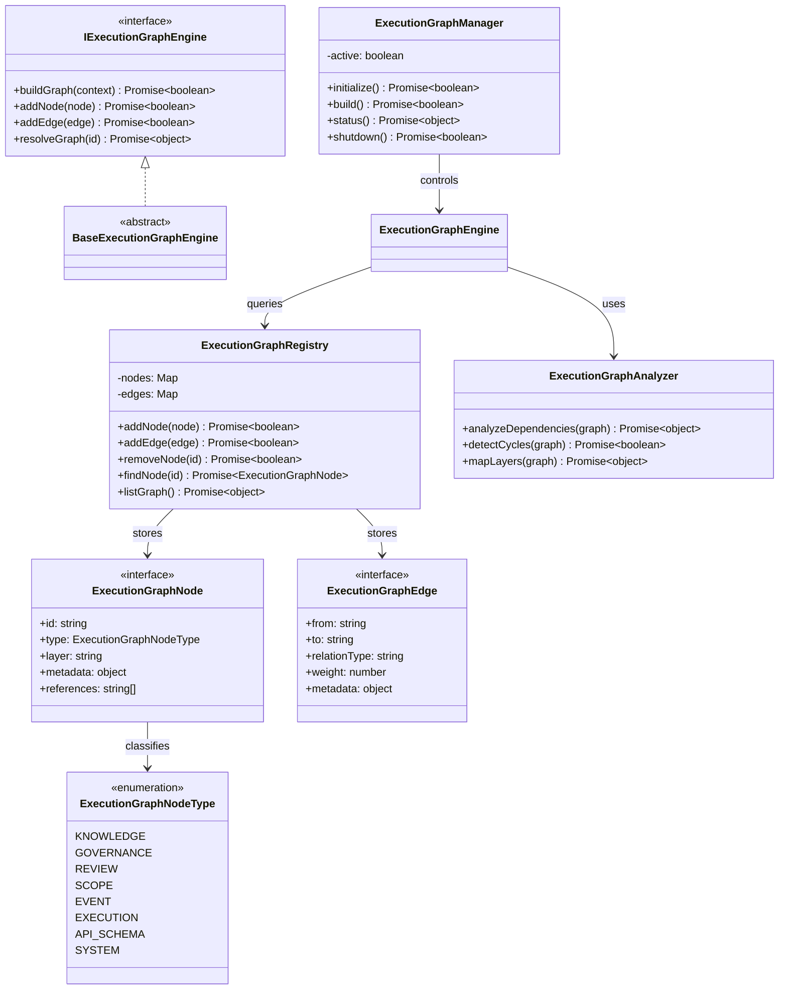

# System Execution Graph Specification (システム実行グラフ定義規範)

Version: 1.0.0
Phase: Phase 130 (System-wide Execution Graph Engine Foundation)
Status: Active

---

## 1. 目的 (Purpose)
本仕様書は、AIOS (Artificial Intelligence Operating System) におけるシステム実行グラフの構造定義（Blueprint）を規定します。
これまで構築されたすべての AIOS 基礎モジュール（ナレッジ・ポリシー・レビュー・スコープ・イベントバス・実行オーケストレーター・APIスキーマ）を統合し、AIOS の動作境界と接続状態を「単一の有向非巡回グラフ (DAG)」として表現するためのデータスキーマとインターフェースを定義します。

---

## 2. 関係性ダイアグラム (Relationship Diagram)
システム実行グラフを構成する型・コントロール・エンジンコンポーネントの依存・参照マップ。

---

## 3. コアデータモデル (Core Data Models)

### 3.1 ExecutionGraphNodeType
- **KNOWLEDGE**: ナレッジエンジン上のデータノード。
- **GOVERNANCE**: ポリシーエンジン上の検証ルール・条件ノード。
- **REVIEW**: 自律レビュー実行モデルノード。
- **SCOPE**: スコープ制御（ロック範囲・アクセス境界）ノード。
- **EVENT**: イベントバスによって発信・配送されるシグナルノード。
- **EXECUTION**: オーケストレーターで管理される実行・タスク状態ノード。
- **API_SCHEMA**: APIスキーマアナライザーで表現されるエンドポイント・型ノード。
- **SYSTEM**: OSおよびプラットフォーム内部状態ノード。

### 3.2 グラフ構造モデル
グラフは複数のレイヤーを跨ぐ `ExecutionGraphNode` と、それらを接続する `ExecutionGraphEdge` の集合として定義されます。

---

## 4. 将来の実行統合ロードマップ (Future Roadmap)
* **自律AIプランニングエンジンとの結合 (Phase 131 予定)**:
  本フェーズで確立した統合グラフ表現（System Execution Graph）をもとに、AIが自律的に実行順序をプランニングするための経路探索・プランニングエンジンが統合されます。
