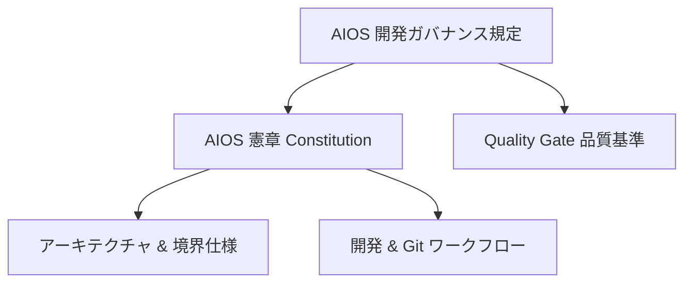

# AIOS 開発ガバナンス規定 (AIOS Development Governance)

## 概要
本規定は、AIOS (AI Operating System) プラットフォーム開発における最上位のガバナンス基準を定義します。今後すべての開発ライフサイクル、品質基準（Quality Gate）、Git運用、リリース運用は、本ガバナンス規定に厳格に従わなければなりません。

## ガバナンス三原則
1. **プラットフォーム・コアの防衛 (Core Preservation)**
   - プラットフォームの独立性を脅かす一切のドメイン固有コード（特定の業務ロジックや顧客要件）の混入を禁止します。
2. **品質ゲートの強制 (Enforced Quality Gate)**
   - すべての変更は、定義されたQuality Gateを完全にパスしない限り、コミットおよびマージを禁止します。いかなる例外も認めません。
3. **監査可能性の維持 (Absolute Auditability)**
   - 変更履歴、テスト実行結果、アーキテクチャ境界の検証ログは、すべて自動的に記録され、追跡可能でなければなりません。

## ガバナンス構造
AIOS開発におけるガバナンスのピラミッド構造を以下に定義します。

## 遵守基準と違反へのペナルティ
- **コミットブロック**: Quality Gateのチェック（ビルド、テスト、依存関係チェック等）が1項目でも失敗した場合、Git Commitはシステム的または運用ルール的に禁止されます。
- **デプロイブロック**: 本規定のリリース基準を満たさないバイナリまたはコードは、ステージング環境および本番環境へのリリースをブロックします。
- **コード差し戻し**: ガバナンスまたは命名規則に違反するコードは、レビューフェーズにおいて即座に差し戻し（Reject）されます。
