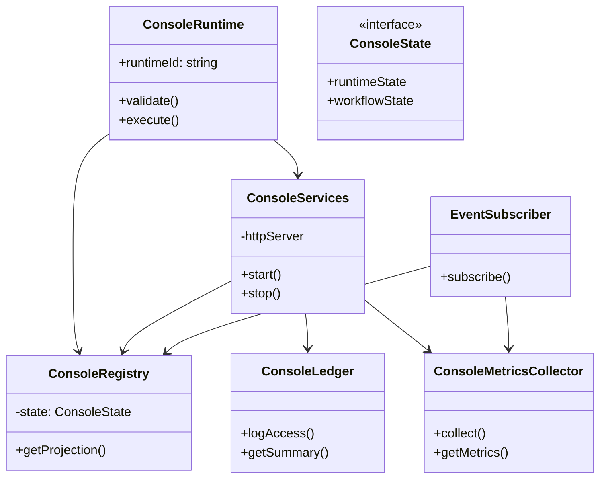

# Console アーキテクチャ仕様書 (Console Architecture)

## 概要
本仕様書は、AIOS プラットフォームにおける「Platform Observation Layer（プラットフォーム観測層）」としての Console の内部構造および構成コンポーネント間のデータ連携方式を定義します。

## 射影原則の適用 (Projection Principle Compliance)
Console は、状態変更を直接行うAPIやDB接続を持ちません。状態の獲得は、すべて「不変元帳（Immutable Ledger）から状態モデルへと射影（Projection）された読み取り専用データ」を介して行われます。

```
+------------------+
| Immutable Ledger | (不変元帳: システム実行のログ・証跡)
+------------------+
         |
         v
+------------------+
|    Projection    | (射影処理: ログを集約・最新状態を算出)
+------------------+
         |
         v
+------------------+
|  Console State   | (読み取り専用状態表示)
+------------------+
         |
         v
+------------------+
|  Console Runtime | (HTTP API / 観測層)
+------------------+
```

### 書き込みAPIの禁止
Console が提供する API および Registry には、状態を変更（Write / Update / Delete / Mutate）するメソッドは一切定義されません。

---

## 内部コンポーネント構造
Console Runtime は、以下の自律したモジュール群で構成されます。



### 1. Console Registry (`ConsoleRegistry`)
- **役割**: 不変元帳やイベントから再構築された最新の「Console State」をメモリ上に保持する、読み取り専用レジストリ。
- **データ不変性**: 外部へ提供する状態オブジェクトは、すべて再帰的に凍結（`deepFreeze`）され、呼出し元での意図しない改ざんを防ぎます。

### 2. Console Services (`ConsoleServices`)
- **役割**: 観測に必要な周辺サービス（読み取り専用 HTTP API サーバー等）のライフサイクル管理。

### 3. Console Ledger (`ConsoleLedger`)
- **役割**: 観測された履歴やアクセスログの保持、および元帳データのサマリーの整形。

### 4. Console Metrics Collector (`ConsoleMetricsCollector`)
- **役割**: プラットフォーム稼働情報（イベント数、処理時間等）を定期的に収集・集計するカウンター。

### 5. Event Subscriber (`EventSubscriber`)
- **役割**: `RuntimeEventBus` を購読し、受け取ったイベント情報に基づいて `ConsoleRegistry` や `ConsoleMetricsCollector` を非同期に更新する。
