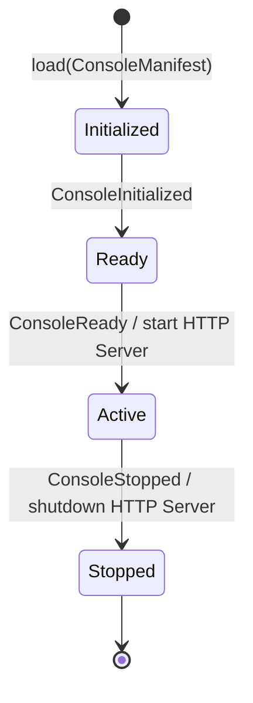

# Console Runtime 仕様書

## 概要
本仕様書は、AIOS (AI Operating System) の監視および可視化を司る Platform Observation Runtime である「Console Runtime」の仕様を定義します。Console Runtime は、AIOS 実行環境のメタデータ、メトリクス、イベント、監査元帳の状態を統合して観測するための標準的な実行コンポーネントです。

## 責務
Console Runtime の責務は、以下の「読み取り・観測」機能のみに厳格に制限されます。

1. **システム実行状態の可視化 (State Visualization)**: AIOS Core およびプラグイン等の動作状況やアクティブセッションの表示。
2. **イベントモニタリング (Event Observation)**: `RuntimeEventBus` を流れるシステム状態イベントの監視と蓄積。
3. **射影状態の表示 (Projection Display)**: `RuntimeLedger`（不変元帳）から構築された読み取り専用ビューモデルの表示。
4. **ヘルスステータスの表示 (Health Monitoring)**: プラットフォーム全体の稼働健全性の可視化。
5. **メトリクスの表示 (Metrics Monitoring)**: 処理速度やリソース消費、リクエスト件数などの統計情報の表示。
6. **監査トレールの表示 (Audit Log Display)**: 不変監査証跡の参照。

### ❌ 禁止事項 (Banned Operations)
Console Runtime およびその配下のサービスは、以下の操作を行うことを厳格に禁止されます。
- **ビジネス・ドメインロジックの実行**: 選挙、ポスティング、顧客ロジックなどのアプリケーション特有の計算処理。
- **実行状態の変更 (State Mutation)**: ランタイムや登録情報の状態を直接書き換える書き込み処理。
- **実行制御 (Runtime Control)**: プロセスの直接の停止、再起動、タスクの手動割り当てなどの書き込み操作。

## ライフサイクル (Lifecycle)
Console Runtime は、以下のライフサイクル遷移を持ちます。



1. **Initialized (初期化完了)**: マニフェスト（`ConsoleManifest`）がロードされ、`ConsoleRegistry` のメモリ展開が完了した状態。
2. **Ready (待機状態)**: プラットフォーム内のイベントリスナーおよびメトリクスコレクターへの購読が完了した状態。
3. **Active (観測稼働中)**: HTTP 読み取り専用 API サーバーが起動し、ポートをバインドして外部への観測情報提供が稼働している状態。
4. **Stopped (停止)**: サーバーが安全にシャットダウンされ、イベント購読が解除された状態。

## 設定仕様 (Console Manifest)
Console Runtime の起動設定は、以下の `ConsoleManifest` に従います。

```typescript
export interface ConsoleConfiguration extends RuntimeConfiguration {
  port: number; // 読み取り専用APIを提供するHTTPポート
  metricsIntervalMs: number; // メトリクス集計のポーリング周期
}

export interface ConsoleManifest extends RuntimeManifest {
  consoleId: string;
  configuration: ConsoleConfiguration;
}
```
