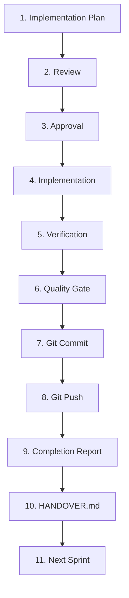

# 標準開発ワークフロー (Development Workflow)

## 概要
本仕様書は、AIOS プラットフォームにおける標準的なスプリント開発プロセスを定義します。本フローは、プラットフォームの品質保証、変更履歴の透明性、およびAIエージェントと人間の協調を円滑にするために厳格に運用されます。

## 標準開発フロー定義
AIOS 開発における正式な開発プロセスは、以下のライフサイクルに従って順番に実行されなければなりません。

## 各フェーズの詳細

### 1. Implementation Plan (実装計画作成)
- **タスク**: 実装を開始する前に、変更の目的、影響範囲、ファイルごとの修正内容、および検証計画をまとめた `implementation_plan.md` を作成または更新します。
- **アウトプット**: `/Users/katsujiiwasa/.gemini/antigravity-ide/brain/<conversation-id>/implementation_plan.md`

### 2. Review (レビュー)
- **タスク**: 作成した `implementation_plan.md` をユーザー（人間または上位AI）に提示し、設計のレビューを求めます。

### 3. Approval (承認)
- **タスク**: ユーザーからの明確な「承認（GO/OK）」を取得します。承認を得るまで、ソースコードの変更や削除を行ってはなりません。

### 4. Implementation (実装)
- **タスク**: 承認された実装計画に厳密に従い、コードの作成・編集を実行します。

### 5. Verification (検証)
- **タスク**: 実装完了後、ローカルテストおよび検証スクリプトを実行し、実装にバグやエラーがないか確認します。
- **実行内容**: ユニットテストの実行、実機を想定したエッジケースの検証。

### 6. Quality Gate (クオリティゲート)
- **タスク**: 定義されたすべての Quality Gate 指標（ビルド、リンター、アーキテクチャ・依存関係チェック）の検証を実行し、すべてが合格（PASS）することを確認します。

### 7. Git Commit (コミット)
- **タスク**: Quality Gate を完全にパスしたことを確認した後、変更内容を明確に記述したコミットメッセージとともにローカルコミットを実行します。

### 8. Git Push (プッシュ)
- **タスク**: プッシュ前チェック（ワーキングツリーのクリーン、ブランチ・バージョン検証など）をパスした状態で、指定された開発用リモート（`origin-dev` 等）へプッシュを実行します。

### 9. Completion Report (完了報告)
- **タスク**: コミットハッシュ、検証スクリプトの実行結果、および変更概要をチャット等を通じて完了報告書として提出します。

### 10. HANDOVER.md (引継ぎ情報の更新)
- **タスク**: 次回のスプリントや別のエージェントがスムーズに作業を再開できるよう、現在の開発ステータス、完了した変更点、次回アクションを `HANDOVER.md` に追記・更新します。

### 11. Next Sprint (次スプリント)
- **タスク**: 次の開発対象タスクまたは機能フェーズへ移行します。
