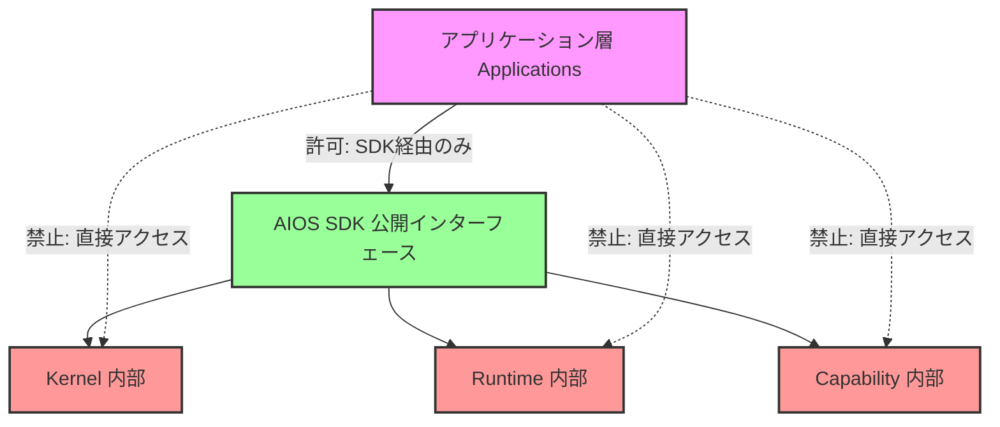

# プラットフォーム境界仕様 (Platform Boundary)

## 概要
本仕様書は、AIOS プラットフォームとアプリケーション層の間の厳格なアクセス境界を規定します。プラットフォームの安全性、機密性、および保守性を担保するため、境界線を越えた直接アクセスを厳しく禁止します。

## プラットフォーム境界モデル

## 禁止されるアクセス経路 (Forbidden Direct Access)
アプリケーション層は、以下のレイヤーの内部モジュールや非公開APIを直接インポートまたは呼び出すことを禁止されます。

1. **Kernel Internal**: プロジェクト管理、ファイルシステム操作、基礎ライフサイクル等のカーネル内部ロジック。
2. **Runtime Internal**: `RuntimeEventBus`の実装、`RuntimeLedger`の直接書き込み、スケジューラ、モニタリング内部等の実行基盤。
3. **Capability Internal**: セキュリティ、自動化、監査等の個別のケイパビリティモジュール内部。

## 境界制御のポリシー
- アプリケーションは、必ず `sdk/` パッケージが提供する公開クラス、関数、インターフェースのみを利用しなければなりません。
- パッケージ間の依存関係は、コンパイル時および静的解析時に厳格にチェックされ、違反が検出されたビルドは即座に却下されます。

## 【Phase 2 実装予定】自動境界検証システム (Boundary Validators)
Phase 2 において、以下の自動検証ツールを導入し、CI/CDおよびコミット前フックにて境界違反を100%遮断します。

1. **Dependency Scanner (依存関係スキャナー)**:
   - プロジェクト全体のモジュール依存グラフを解析し、許可されていない依存パス（例: `apps/ -> core/`）を検出します。
2. **Import Rule Checker (インポートルールチェッカー)**:
   - ソースコード内の `import` 文を静的解析し、`kernel`, `runtime`, `capability` 内部ディレクトリからの直接インポートを検出してエラーにします。
3. **Architecture Validator (アーキテクチャバリデータ)**:
   - レイヤー階層（下位から上位への逆流依存など）が定義されたアーキテクチャ定義ファイルに準拠しているかを検証します。
4. **SDK Boundary Validator (SDK境界バリデータ)**:
   - SDKが外部に公開しているシンボル（Public API）のみがアプリケーションに参照されているかを検査し、非公開APIの漏洩を防ぎます。
