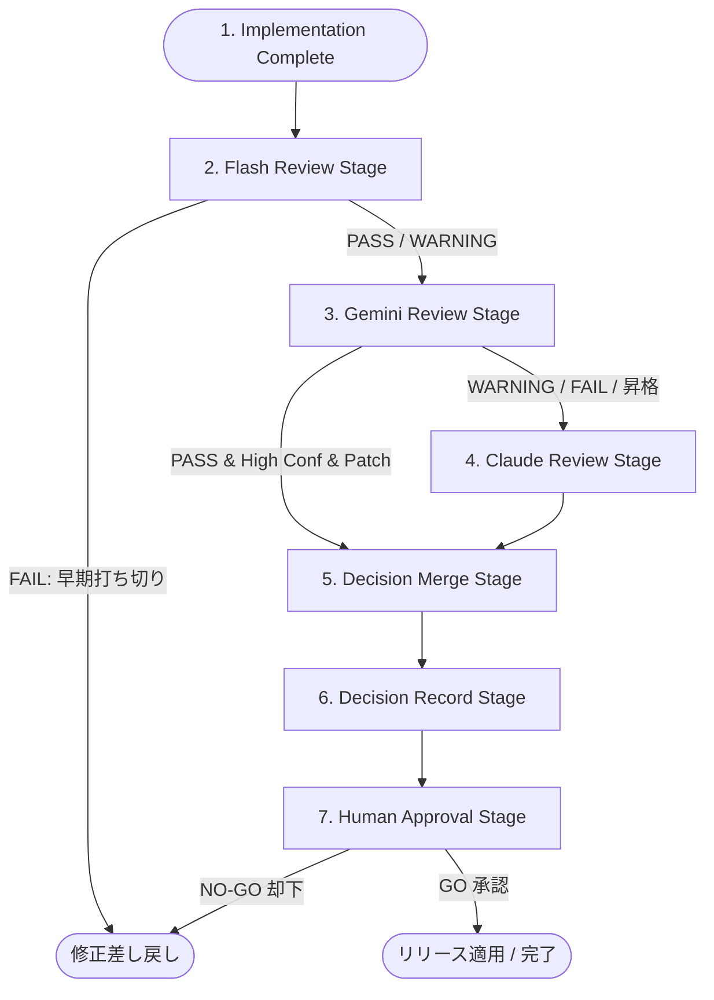

# AIOS Review Pipeline Specification (レビューパイプラインプロセス定義規範)

Version: 1.0.0
Phase: Phase 116 (Review Pipeline Foundation)
Status: Active

---

## 1. 目的 (Purpose)
本仕様書は、AIOS (Artificial Intelligence Operating System) における開発コードおよび設計ドキュメントの検証処理を決定論的に制御するため、各種 AI レビューレイヤー（Flash, Gemini, Claude）および人間による査読（Human Approval）の実行手順、中間コンテキスト、判定合成ロジック、エラーハンドリング、および双方向トレーサビリティを規定します。

---

## 2. パイプラインアーキテクチャ (Review Pipeline Architecture)
Review Pipeline は、実装完了イベントの検知から本番リリースに至る検証プロセスを以下の直線的・条件分岐的なステージ遷移として制御します。



---

## 3. パイプラインステージ定義 (Pipeline Stages)

### Stage 1: Implementation Complete (実装完了検知)
* **概要**: 開発AIによるドキュメント記述またはコード変更の完了をフックして開始。
* **入力**: 対象コミット、変更ファイル差分（Diff）、更新された仕様ドキュメント。

### Stage 2: Flash Review (第一検証)
* **概要**: typo, naming, duplicate, doctor, verify, document などの高速・機械的整合性のセルフチェックを実行。
* **出力**: `PASS` / `WARNING` / `FAIL` の結果コードおよび確信度（Confidence）。

### Stage 3: Gemini Review (設計検証)
* **概要**: DTO規律、Managerの非破壊原則、データ辞書（Data Dictionary）への適合、レイヤー依存マップの整合性を検証。
* **出力**: `PASS` / `WARNING` / `FAIL`。

### Stage 4: Claude Review (統制監査)
* **概要**: `DevelopmentOS`, `AuditOS` 原則への適合、不変履歴照合、長期コンテキスト整合性、全体アーキテクチャの監査を実行。
* **出力**: `PASS` / `WARNING` / `FAIL`。

### Stage 5: Decision Merge (判定マージ)
* **概要**: 各ステージから収集された評価判定を決定論的マージロジックに基づき統合。
* **マージ論理**:
  * すべてのレイヤーが `PASS` ──> 総合判定: `PASS`
  * 警告が一件以上存在 ──> 総合判定: `WARNING`
  * 却下（`FAIL`）が一件でも存在 ──> 総合判定: `FAIL`

### Stage 6: Decision Record (レコード生成)
* **概要**: マージされた判定およびエビデンスを、`DEC-YYYY-NNNN` のフォーマットで意思決定レコードとして永続化。

### Stage 7: Human Approval (手動承認ゲート)
* **概要**: 人間の承認者（岩佐CEO）による最終査読。
* **判定**: `GO` (リリース許可) / `NO-GO` (却下差し戻し) / `Deferred` (保留) / `Review Required` (再レビュー)。

---

## 4. パイプライン入出力 & コンテキスト (Input, Output & Context)

### 4.1 パイプライン入出力
* **入力データ群**:
  * 開発差分（Commit, Diff）
  * 各種レジストリ（Rule Registry, Incident Registry, Data Dictionary, Knowledge Base, Audit History）
* **出力データ群**:
  * レビュー報告書 (`REV`)
  * 意思決定レコード (`DEC`)
  * 監査履歴レコード (`HIS`)
  * 新規教訓候補 (`KB` 候補)

### 4.2 パイプラインコンテキスト (Pipeline Context)
ステージ間で受け渡される状態オブジェクト。

* `commit`: 対象コミットハッシュ。
* `files`: 変更ファイルパスリスト。
* `changed_specs`: 更新された仕様書SINリスト。
* `confidence`: 判定の確信度レベル。
* `severity`: 検出された最高重大度。
* `evidence`: 判定の証跡テキスト（verify / pytest ログ等）。
* **`context_version`**: パイプラインコンテキストのデータ互換バージョン。将来のデータ構造進化を安全にサポートするためのバージョン識別子（例: `"1.0.0"`）。

---

## 5. 制御ポリシー (Control Policies)

### 5.1 早期打ち切り (Early Termination)
* 下位の Flash レイヤーで `FAIL` が検知された場合、Orchestrator は即座にパイプラインを打ち切り、Gemini / Claude の呼び出しをスキップして、開発エージェントに修正を要求します。

### 5.2 早期バイパス (Early Bypass)
* 以下の3条件がすべて満たされた場合に限り、Gemini / Claude のレビューをバイパス（スキップ）して直接人間へ GO 承認を要求することができます：
  1. Flash レビュー結果が `PASS` であること。
  2. Flash レビュー確信度が `High` であること。
  3. 変更規模が軽微なドキュメント修正（Patch レベルの変更）であること。

### 5.3 エラー・リトライポリシー (Retry Policy)
* **API / ネットワークタイムアウト**:
  * 接続失敗時は、指数バックオフアルゴリズム（Exponential Backoff）を用い、最大3回まで再試行（Retry）。
* **検証タイムアウト**:
  * テスト実行時間制限を超過した場合は `BLOCKED` (Abort) 判定とし、人間へのエスカレーション（Escalate）をトリガー。

---

## 6. レビュー追跡性 (Review Traceability)
各レコードのID関係は、以下の順番で不変参照（ID Linkages）され、Audit Dashboard から完全に追跡可能となります。

```
[REV-YYYY-NNNN] (レビューログ)
       │
       ▼
[DEC-YYYY-NNNN] (意思決定レコード: REV を証跡参照)
       │
       ▼
[AUD-YYYY-NNNN] (セッションログ)
       │
       ▼
[HIS-YYYY-NNNN] (監査不変履歴: DEC を証跡として内包)
       │
       ▼
[KB-YYYY-NNNN] (ナレッジベース: 却下された DEC の RCA から抽出)
```

---

## 7. 将来の実行統合ロードマップ (Future Runtime Integration)
* **パイプラインオートメーション (tools/specifications/review_pipeline.json)**:
  将来的に、各ステージの入力スキーマ、マージ論理、およびリトライ上限は `review_pipeline.json` にて定義されます。コミットやPR作成を契機に、CIE Orchestrator が API Gateway を仲介して Flash/Gemini/Claude API を順次非同期実行し、結果をマージした上で人間に通知する処理エンジンを実装します。
