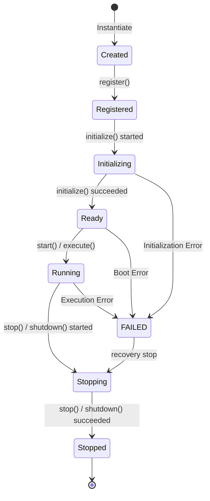

# Runtime Lifecycle 仕様書

## 概要
本仕様書は、AIOS プラットフォームにおけるすべての Runtime のライフサイクル状態およびその遷移規則を定義します。

## ライフサイクル状態 (States)

1. **Created (生成)**: インスタンスがメモリ上に確保された初期状態。
2. **Registered (登録完了)**: `RuntimeService` への登録が完了し、メタデータが公開された状態。
3. **Initializing (初期化中)**: 各種リソースの割り当てや依存解決が行われている中間状態。
4. **Ready (待機中)**: 初期化が完了し、実行可能な状態。
5. **Running (稼働中)**: 実実行、APIのリスニング、またはタスク処理が活発に行われている稼働状態。
6. **Stopping (停止中)**: サービスシャットダウン、リソース解放中の中間状態。
7. **Stopped (停止)**: 実行が完全に停止され、再度 Ready または解放可能な状態。

---

## ライフサイクルイベント
すべての状態遷移時には、以下の `AIOSEvent` が `AIOSEventBus` を通じて発行されます。
- `RuntimeRegistered`: 登録完了時
- `RuntimeReady`: 初期化成功（Ready移行）時
- `RuntimeStarted`: 起動（Running移行）時
- `RuntimeStopped`: 停止（Stopped移行）時
- `RuntimeRemoved`: 登録解除時
- `RuntimeHealthChanged`: 健全性状態の変化検出時
