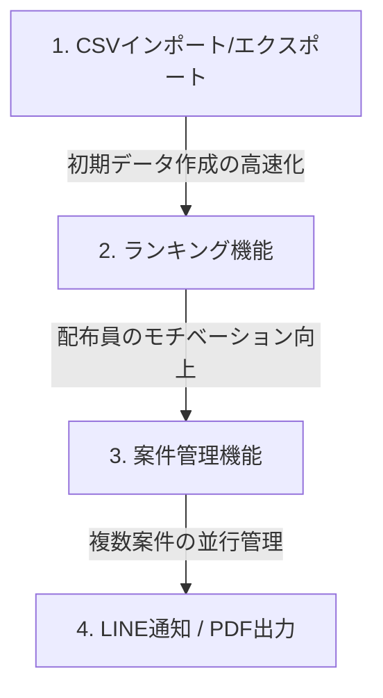

# 設計＆拡張ロードマップ - FIELD OPERATIONS OS 「POSTING MAP」

ユーザー様より提示された将来の5大機能について、本OSの理念（高級感・高速性・安定性・実運用性・政治現場統制）に基づいた具体的な設計案と優先順位のロードマップを作成しました。

---

## 1. 将来の5大拡張機能の設計仕様

### 1-1. PDF (公式実績レポート出力)
候補者や後援会、スポンサーにそのまま提出できる、格式高い「公式配布実績証明書」を出力します。

- **UI/UX (監視ページ / システムタブ)**:
  - 「PDFレポート出力」ボタンを配置。
  - 黒・白・金を基調とした、Appleの公式認定書のような美しいプレミアムレイアウトテンプレート。
- **バックエンド (GAS)**:
  - 三重2区の「全体戦略マップ（Google Maps画像）」、日付ごとの配布推移グラフ、地区別実績テーブルを自動収集。
  - GAS側でGoogleドキュメントのテンプレートへ流し込み、PDF形式でエクスポート。Googleドライブへ自動保存し、フロントに高速でダウンロードURLを返す。

### 1-2. ランキング (モチベーション・統制)
配布員ごとの実績をランク付けし、現場の配布ペースと統制力を劇的に向上させます。

- **UI/UX (配布員アプリ ＆ 管理者アプリ P2)**:
  - 「期間内配布数」「稼働率」「配布速度」を基にした、プレミアムなガラス調リーダーボードを表示。
  - 1位〜3位のカード枠に微弱なゴールド・シルバー・ブロンズのグラデーション発光（高級感を維持）を施し、ゲーム性を持たせてモチベーションを刺激。
- **バックエンド (GAS)**:
  - `scripts/v2_api.gs` の `getRanking` アクションを本格実装。
  - 毎晩の「統計情報集計」バッチ処理のタイミングで、各配布員のGPS履歴と配布完了データからランキング用サマリーを自動生成・キャッシュ化。

### 1-3. LINE通知 (リアルタイム現場指示)
配布員と管理者の双方向コミュニケーションを円滑にし、通信不安定環境でも確実に指令を伝達します。

- **UI/UX (管理者用コントロール ＆ 配布員通知)**:
  - 配布員が「配布開始」「配布終了」をタップした際、管理者に自動でLINE通知。
  - 管理者画面からオンラインの配布員へ「〇〇地区の配布を手伝ってください」といった個別のプッシュ指示を送信可能に。
- **バックエンド (GAS / LINE Messaging API)**:
  - スクリプトプロパティに `LINE_CHANNEL_ACCESS_TOKEN` を登録。
  - 配布員登録時にLINEの `userId` を `Roster` シートに自動紐づけ。
  - GASのトリガー、または管理者アクションからLINEプッシュAPIを高速で非同期配信。

### 1-4. CSV (外部データ連携・高速インポート)
名簿システムや他社の選挙ドックなど、既存の住所リストを一括で流し込み、現場で即座に地図化します。

- **UI/UX (システム制御タブ)**:
  - 「名簿・住所CSVのインポート」ドラッグ＆ドロップ領域（ガラスUI）。
  - 「実績データのCSVエクスポート」ボタン。
- **バックエンド (GAS)**:
  - アップロードされたCSVデータをパースし、新地区のシートを自動生成。
  - 住所データをバックグラウンドで Maps ジオコーディング（永続座標キャッシュへ自動保存）し、マップ上に数秒でピンを表示。
  - GPSログをCSV形式にエンコードして高速ダウンロード生成。

### 1-5. 案件管理 (複数案件の並行ポスティング管理)
「後援会だより5月号」「候補者チラシ」「投票依頼ハガキ」など、異なる配布物を並行して管理・切り替えできるようにします。

- **UI/UX (監視ページ1の上部)**:
  - ヘッダー下に「現在のアクティブ案件」を切り替えるガラス調プルダウンメニューを配置。
  - 案件を切り替えると、マップのピンの色（進捗）や全体配布率が、その案件のデータに瞬時にフェードインで切り替わる。
- **バックエンド (GAS)**:
  - `Projects`（案件マスタ）シートを新設。
  - 各地区シート内に、案件ごとの配布完了フラグ（`done_project_A`, `done_project_B`など）を動的に構築し、APIがリクエストされた案件IDに応じて進捗データを切り替えて抽出。

---

## 2. 実装の優先順位（提案）

現場での運用の流れと開発の難易度から、以下の順での実装を提案いたします。

1. **第1フェーズ：CSVインポート/エクスポート ＆ ランキング**
   - 地図機能が完成した今、次に必要なのは「住所データの大量一括登録（CSV）」と「配布員の稼働モチベーション維持（ランキング）」です。
2. **第2フェーズ：案件管理**
   - 現場で最も発生する「複数種類のチラシを同時に、または別々に配り分ける」実運用に対応します。
3. **第3フェーズ：LINE通知 ＆ PDF実績レポート出力**
   - 配布員とのリアルタイム接続体制の確立と、最終的な候補者（スポンサー）への美しい成果報告PDFの発行を自動化します。

---

## 3. 追加検討：FIELD OPERATIONS OSとしてのキラー機能案

実運用における統制力・使いやすさをさらに極限まで高めるため、以下の革新的な機能案を考案しました。

### 3-1. オフライン完全同期 (PWA Offline Sync Pro)
電波の届かない山間部、ビル影、路地裏でもアプリが絶対にフリーズせず、高齢配布員を「迷わせない」「立ち止めさせない」ための機能。
- **仕様**: オフライン時にはヘッダーの「CONNECTED」表示が自動的に「OFFLINE (LOCAL SECURED)」の琥珀色（微発光）に変わり、GPS軌跡や配布ログを端末内に一時暗号化保存。電波が復帰した瞬間にバックグラウンドで自動的に分割送信（GAS의 バースト負荷を防止）し、完全同期します。

### 3-2. 音声ワンタップステータス（Distributor Voice Command）
スマホ片手で歩きながら、画面を注視したり細かくタップしなくても「〇〇町2丁目の配布完了」と発話するだけでステータスを更新できる機能。
- **仕様**: 音声認識API（Web Speech API等）をバックグラウンドで動かし、高齢者が手袋をしている冬場や、雨天時の傘差し状態でも、足を止めずに安全かつ快適にステータス変更が行えます。音声認識時は画面下部からSiriのような有機的な光の波（微発光グラデーション）がうごめき、完了時に心地よいバイブレーション（物理フィードバック）で知らせます。

### 3-3. リアルタイムエリア応援要請（Team Action Ops）
配布員チーム全体のスピードを最大化し、誰も孤立させない現場統制機能。
- **仕様**: 自分の担当エリアが早く終わった配布員が、遅れている隣のエリアのピンをタップして「応援に入る」を宣言。あるいは、遅れている配布員が「このエリアの応援求む！」とワンタップでチーム全体にヘルプを要請。応援要請中のエリアはマップ上で赤や黄色のパルス（脈打つ微発光）で点滅し、助け合いを可視化します。

### 3-4. 配布員の見守り・安全サポート (Safety & Health Guard)
「犯人探し（監視）」の冷たいシステムにするのではなく、現場で働く高齢配布員たちの「体調や安全を優しく見守る」ためのサポート機能。
- **仕様**: 気温が高い日の配布中、同じ場所に一定時間以上（例: 20分以上）留まっている配布員がいる場合、管理画面に「見守りアラート'」を優しく表示。管理者は「熱中症や体調不良、自転車のパンクなどはありませんか？」とLINE経由でワンタップで気遣いの連絡（安否確認）ができる、現場の安全ファーストな見守りシステムです。

### 3-5. ワンタップ配布指令 (LINE Direct Dispatch)
管理者が地図から特定の地区を選び、タップ1つで配布員宛てに「この地区の配布に向かってください」とダイレクトに指示を送信する現場統制の目玉機能。
- **仕様**:
  - 管理者用マップのポップアップ（InfoWindow）または地区詳細画面に「LINEでこの地区の配布指示を送る」ボタンを配置。
  - ボタンをタップすると、現在登録されている（またはオンラインの）配布員のリストがハーフモーダルでスライドアップ表示。
  - 配布員を選択して「送信」を押すだけで、対象配布員のLINE（Messaging API連携）へ直接、**「候補者チラシの配布指示：亀山市〇〇町エリアをお願いします。地図はこちら [リンク]」** という指示メッセージがプッシュ送信されます。
  - 配布員がLINE内のリンクを押すと、配布員用アプリの該当地区の地図画面がダイレクトに起動する仕組みです。
