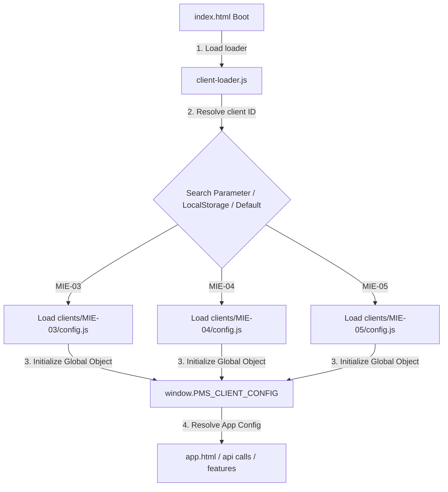
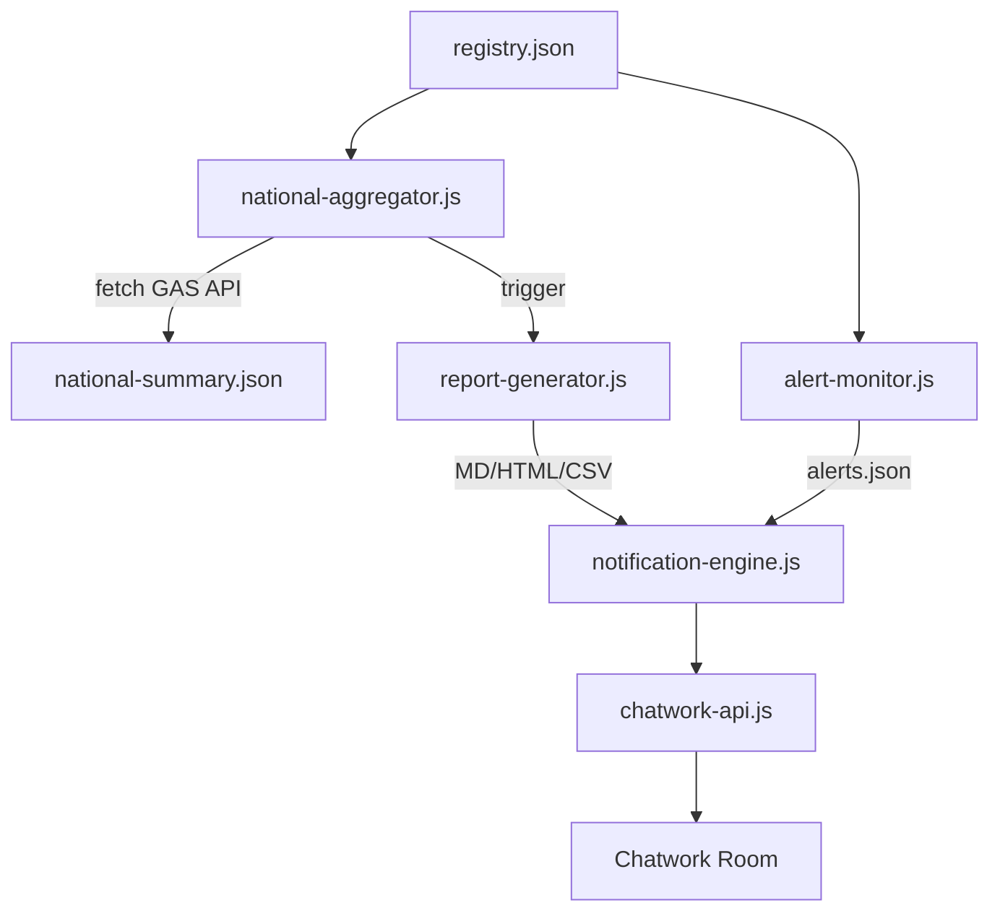

# Handover Document: POSTING MAP Foundation Phase 31–37

## 1. 概要
本リポジトリは、POSTING MAP を全国 289 選挙区・支部へ展開するための「SaaS型 共通コアアプリケーション構造」への移行を完了しました。
Phase 31（Deployment Certification）から Phase 37（Chatwork Notification Foundation）まで、7 フェーズにわたる運用基盤の構築が完了し、Foundation Freeze の条件を満たしています。

---

## 2. アーキテクチャと制御フロー

### 全体ライフサイクル
```
Deployment → Provisioning → Configuration → Operations → Analytics → Reporting → Notification
```

### クライアント設定解決フロー


### 運用データフロー


---

## 3. Phase 別 完了サマリー

### Phase 31: District Deployment Certification
- **`deploy-verify.js`**: GET/POST/Write の 3 段階ゲート検証で READY 判定を発行。
- GAS 側 Rule Engine（Spreadsheet / Drive / EventLog）と連携。

### Phase 32: District Provisioning Foundation
- **`provision-district.js`**: Drive リソース自動複製、OAuth 検証ループ、`clients/` 配下への config.js / deployment.json 自動生成。
- **`cleanup-district.js`**: 失敗時ロールバック。READY 状態の誤ロールバック防止機構付き。
- **`oauth-checker.js`**: GAS OAuth ゲートウェイブロックの自動検出。

### Phase 33: Client Configuration Partitioning
- **`client-loader.js`**: URL パラメータ → LocalStorage → デフォルト の 3 段フォールバックでクライアント設定を動的解決。
- ディレクトリトラバーサル防止のサニタイズ処理付き。

### Phase 34: Multi-District Operations Foundation
- **`registry-manager.js`**: `clients/` ディレクトリスキャンによる `registry.json` 自動再構築、重複 ID 検出、スキーマ検証。
- **`bulk-ops.js`**: 全地区への並列ヘルスチェック、一括 clasp デプロイ。`.clasp.json` の安全な復元を `finally` ブロックで保証。
- **`admin-registry.html`**: 漆黒ガラスモーフィズム UI の HQ ダッシュボード。

### Phase 35: Headquarters Operations Platform
- **`national-aggregator.js`**: 全地区 GAS API への並列 fetch で全国 KPI を集計。`national-summary.json` を生成。
- **`alert-monitor.js`**: STATE_BLOCKED / VERSION_MISMATCH / HEARTBEAT_LOST の 3 種アラートを自動検知。`alerts.json` へ出力。

### Phase 36: Automated Reporting Foundation
- **`report-generator.js`**: Markdown / HTML / CSV の 3 形式でレポートを自動生成。
- `history.json` による生成履歴管理（100 件上限自動トリム）。

### Phase 37: Chatwork Notification Foundation
- **`chatwork-api.js`**: Chatwork API ラッパー。環境変数未設定時は Mock モードへ自動フォールバック。
- **`notification-engine.js`**: アラート / レポート / プロビジョニング成功の 3 系統を統一配信。
- `notifications-history.json` による送信履歴管理（100 件上限自動トリム）。

---

## 4. 稼働実績と検証ステータス

| 地区 | ステータス | 用途 |
| :--- | :--- | :--- |
| MIE-03 | ✅ READY | 本番実運用稼働中 |
| MIE-04 | ✅ READY | プロビジョニング検証済み |
| MIE-05 | ✅ READY | 自動プロビジョニングテスト |

### テスト合格実績
| テスト | Phase | 結果 |
| :--- | :--- | :--- |
| `client-loader-test.js` | 33 | ✅ 6/6 PASS |
| `registry-integrity-test.js` | 34 | ✅ 3/3 PASS |
| `alert-monitor-test.js` | 35 | ✅ 3/3 PASS |
| `report-generator-test.js` | 36 | ✅ 4/4 PASS |
| `notification-integration-test.js` | 37 | ✅ 3/3 PASS |

---

## 5. ドキュメント一覧

### 仕様書 (docs/specifications/)
- `DistrictDeploymentFoundation.md` — Phase 31
- `DistrictProvisioningFoundation.md` — Phase 32
- `ClientPartitioningFoundation.md` — Phase 33
- `ClientConfigurationSchema.md` — Phase 33
- `MultiDistrictOperationsFoundation.md` — Phase 34
- `HeadquartersOperationsPlatform.md` — Phase 35
- `AutomatedReportingFoundation.md` — Phase 36
- `ChatworkNotificationFoundation.md` — Phase 37

### 運用ガイド (docs/operations/)
- `DeploymentGuide.md` / `ProvisioningGuide.md` / `ClientSwitchGuide.md`
- `HQOperationsGuide.md` / `NationalAnalyticsGuide.md`
- `ReportingOperationalGuide.md` / `NotificationConfigGuide.md`

---

## 6. Workspace & AIOS Order Pipeline Migration Summaries (2026-07-18 Update)

本リポジトリは、SaaS 運用の基盤整備に加え、正規の Google Drive ワークスペース構造へのバインド、および自動プロビジョニング・アクティベーションへとつながる AIOS 注文パイプラインの結合を完了しました。

### 6.1. Google Drive Workspace & Master Reference Migration
* **`AssetRegistry` / `AssetRegistryService` の確立**: 
  - `FIELD_OPERATIONS_PLATFORM/` (ID: `1FfcVEQjod--rZSucOPFJD2DJ58hV650_`) を本番 single source of truth とし、配下の 8大サブフォルダとアセット ID の完全な紐付けを自動化。
  - `masters.global` および `masters.districts` の拡張階層スキーマを導入。
* **Master Reference CSV 資産化**:
  - `Address/` および `Postal/` サブフォルダを Drive 上に新規作成。
  - 郵便番号マスター (`KEN_ALL.CSV`) および全国住所マスター (`postal.csv`) をバイナリセーフでアップロード。
  - SHA-256 ハッシュ（チェックサム）、バージョン (`2026-07`)、データソース情報をメタデータとして AssetRegistry に登録し、AIOS が自動検索・参照可能に設定。

### 6.2. AIOS Order-to-Branch Automation Pipeline (Sprint 1 ~ 4)
* **Order-to-Research Foundation**:
  - 注文受付オーケストレータ `OrderRuntime.ts` と `MissionCreator.ts` を実装。
  - 注文（東京第18区等）を元に Research Agent を起動し、内包する基礎自治体リストを抽出して `research-result.json` を出力するフローを自動化。
* **Data Builder Foundation**:
  - `RESEARCH_COMPLETED` イベント駆動によって非同期起動する `DataBuilderRuntime.ts` を実装。
  - `district.json` （市町村オブジェクト配列構造）と `config.json` を自動生成。
  - 地図 of 初期中心座標決定（`map.center: null`）や世帯数・配布目標の設定を Data Builder の責務から除外し、意思決定を伴わない純粋な「初期メタデータコンパイラ」として実装。
* **Provisioning Runtime Foundation**:
  - `DATA_BUILD_COMPLETED` イベントをフックして非同期起動する `ProvisioningRuntime.ts` を実装。
  - Google Drive 連携部 `AssetCloner.ts` を介してスプレッドシートのクローンコピー、およびブランチ専用 Storage フォルダの作成を自動実行。
  - 異常発生時は `FAILED` に遷移し、作成中だった複製ファイルを自動検知して削除する自動ロールバック機能（`ProvisioningStateMachine`）を実装。
  - クローン完了の READY 段階で初めて `AssetRegistry.json` への一括書き込みを行い、環境設定ファイル `deployment.json` (nested `gas` schema) をブランチフォルダへ出力。
* **Runtime Activation Foundation**:
  - `PROVISIONING_COMPLETED` イベントフックにより非同期起動する `ActivationRuntime.ts` を実装。
  - `LineConnector.ts` による共通 LINE インフラ（Login / Msg / Admin）の 20 文字制限適合性および存在チェックを実行。
  - `GasConnector.ts` による、フラット・ネスト双方に対応した GAS WebApp API の疎通ヘルスチェックを自動検証。
  - `ActivationVerifier.ts` により、レジストリバインドと Dashboard 接続パラメータの整合性を検証。
  - 検証フローに `AUDIT_VERIFYING` 状態を追加し、成功時に `runtime` メタデータ、各チェック PASS 状態、監査トランザクションを格納した `activation.json` を出力して `ACTIVE` 状態へ確定。

### 6.3. Dashboard Data Runtime Foundation (Sprint: Dashboard Data Runtime Foundation)
* **Dashboard Data Runtime の確立**:
  - 4つのインプット（`election-research-result.json`, `deployment.json`, `activation.json`, `AssetRegistry.json`）を読み込んでダッシュボードリードモデル `dashboard-data.json` を生成する基盤を構築。
  - ステートレス、かつ決定論的な変換処理を実現。
  - インプット JSON 文字列の連結から算出する決定論的な `sourceHash` によるデータ整合性監査、および `dashboard-runtime-${timestamp}-${shortHash}` 形式の `executionId` による実行インスタンス監査に対応。
  - `DashboardDataContract.ts` を用いた出力契約スキーマ（`schemaVersion: "v1"`）の独立・明確化と厳格な型検証を実現し、未知の将来拡張フィールドを許容しつつ、未来の無効なバージョンは拒否する上位互換性設計を実装。

### 6.4. Dashboard Data Audit Connection (Sprint: Dashboard Data Audit Connection)
* **`DashboardDataAuditEvent` の契約策定**:
  - `eventType: "DASHBOARD_DATA_GENERATED"` を持つ標準イベントスキーマを定義。イベント自身のスキーマバージョン管理（`schemaVersion: "v1"`）に対応。
* **`DashboardAuditPublisher` (隔離イベントバス)**:
  - 監査記録の失敗がリードモデル生成処理に影響を与えないよう、リスナー実行時の例外を try-catch で安全にトラップして隔離するノンブロッキング監査方式を実装。
* **`ExecutionLedgerAdapter` (相互変換と動的登録)**:
  - イベントからプラットフォーム標準の `ExecutionRecord` への型安全なマッピングを実現。
  - レジストリ未登録による例外を防止するため、Capability, Skill, Pipeline 情報を `ExecutionLedgerRegistry` 登録時にオンデマンドで動的事前登録する防衛コードを導入。
  - `executionId` を `ledger-\d+` 正規表現に適合する形式へ決定論的にハッシュ・マッピング。
* **`OutputHashGenerator` (決定論的出力ハッシュ算出)**:
  - 出力 JSON から実行ごとの動的メタデータ（`generatedAt`, `executionId`）を除外した上で SHA-256 チェックサムを算出する機構を分離。同一インプットからのビルドなら同一の `outputHash` が保証される決定論的特性を維持。
* **`DashboardDataIntegrityVerifier` (完全性チェッカー)**:
  - 出力存在チェック、スキーマ定義の妥当性、`sourceHash` の一致、`outputHash` の再計算確認、`schemaVersion` 整合性を一括検証するセキュリティバリデータを実装。
* **Lineage メタデータの埋め込み**:
  - `dashboard-data.json` 内に、インプット元ファイルの系統リスト (`sources`)、`sourceHash`、および `outputHash` を格納する `lineage` オブジェクトを追加。

### 6.5. Dashboard Presentation Runtime Foundation (Sprint: Dashboard Presentation Runtime Foundation)
* **`PresentationContract` の策定**:
  - フロントエンドが直接フェッチして解釈する `PublicDashboardDataContract` を策定。`schemaVersion: "v1"` を必須契約項目として定義。
* **`PresentationBuilder` (プレゼンテーションマッパー)**:
  - 監査済みの `DashboardDataContract` からパブリックデータへの投影変換処理を実装。
* **`PresentationHashGenerator` (決定論的公開ハッシュ算出)**:
  - 公開アセットから動的メタデータ（`generatedAt`, `deploymentUrl`, `executionId`）を除外した状態で SHA-256 チェックサムを算出する機構をカプセル化。入力系統から最終成果物に至る「3段階インテグリティ・チェーン（`sourceHash` -> `outputHash` -> `presentationHash`）」を担保。
* **`DeploymentAdapter` / `LocalFileDeploymentAdapter` (配信先抽象化)**:
  - 各種クラウドストレージ（Drive, GitHub Pages, GAS 等）への配信先差し替えを可能にする `DeploymentAdapter` 抽象化インターフェースを導入し、検証・テスト用のローカルファイル配信アダプターを実装。
* **`PresentationIntegrityVerifier` (最終公開前完全性チェッカー)**:
  - ファイル存在確認、スキーマ適合性、`presentationHash` 再計算検証、および親である `outputHash` との系統チェックを一括実行。

### 6.6. POSTING MAP Dashboard Consumer Foundation (Sprint: POSTING MAP Dashboard Consumer Foundation)
* **`PublicDashboardViewModels` の策定**:
  - UI側が安全かつ型安全にデータをバインドできるよう、公開データ契約からUI表示項目のみを抽出した専用のView Model（`PublicDistrictViewModel`, `PublicMunicipalityViewModel`, `PublicTurnoutViewModel`, `PublicBranchStatusViewModel`, `PublicAssetStatusViewModel`）群を設計・作成。
* **`PublicDashboardDataAdapter` (消費アダプター)**:
  - アセット `public-dashboard-data.json` の非同期フェッチ、バリデーション、および View Model への変換をカプセル化。
  - 環境変数 `process.env.POSTING_MAP_DATA_SOURCE` および `window.POSTING_MAP_CONFIG` に基づき `'MOCK'` (開発・オフライン用フォールバックデータ `DEVELOPMENT_FALLBACK_DATA`) と `'LIVE'` (本番通信データ) を動的に切り替え可能。
  - スキーマ適合性チェック (`validateSchema`) を含み、例外時や不整合時は安全に `'WARNING'` または `'OFFLINE'` 状態へと遷移させてモックデータで補正表示する二重の防御境界を構築。
* **既存 `DashboardStateModel` & `DashboardDataMapper` の拡張**:
  - `DashboardStateModel` に `publicDashboard` (状態: `ONLINE | OFFLINE | WARNING`, データ: `PublicDashboardDataViewModel | null`) リアクティブ管理プロパティを追加。
  - `DashboardDataMapper` に純粋関数としての `mapPublicDashboardData` マッピング処理を実装。

### 6.7. Completion Runtime Foundation (Sprint: Completion Runtime Foundation)
* **`CompletionContract` & `CompletionResult` の策定**:
  - スプリント完了リクエスト (`CompletionRequest`) および結果オブジェクト (`CompletionResult`) スキーマを定義。
* **`TestValidator` (品質判定バリデータ)**:
  - テスト失敗件数のアサーション (`failed > 0` または `passed === 0` および `qualityGate === "FAIL"` 時の `BLOCKED` 遷移) を担当。
* **`GitCommitExecutor` & `GitPushExecutor` (Git処理抽象化)**:
  - Gitの add/commit/push 操作を実行。セキュリティ上のガードレールとして、自動修正、強制プッシュ（Force push）、コンフリクト自動解決は明示的に禁止・ガードレール化。
* **`RemoteVerifier` (リモート同期検証)**:
  - `git fetch` 実行後、ローカル HEAD と `origin-dev/main` の SHA-1 ハッシュが一致しているかアサートし同期完全性を判定。
* **`HandoverGenerator` (ドキュメント更新)**:
  - スプリント名、コミットハッシュ、テスト結果、リモート同期状況を含む固定の構造化フォーマット (`## Sprint Completion Record`) を `HANDOVER.md` の末尾へ自動追記。
* **`CompletionRuntime` (コアランタイム)**:
  - リクエスト受信から、テスト品質検証、Git操作、リモート同期検証、Handover文書追記、`COMPLETION_COMPLETED` 監査イベントの発行までを一括オーケストレーション。同一リクエストでの二重コミットを完全に防ぐ `Replay Safety` 機構を実装。

### 6.8. Runtime Integration Orchestration Foundation (Sprint: Runtime Integration Orchestration Foundation)
* **`RuntimeEventContract` の策定**:
  - 全 Runtime 共通のイベント構造 `RuntimeEvent` を定義し、`correlationId` などのコンテキスト伝達属性を追加。
* **`RuntimeRegistry` (能力レジストリ)**:
  - 各 Runtime 名、バージョン、能力記述（Capabilities）情報を管理し、疎結合性を維持。
* **`RuntimeEventBus` (非同期イベントバス)**:
  - publish / subscribe / unsubscribe のイベント配送制御を担当。例外隔離（Subscriber Exception Isolation）を実装し、一部の Runtime 障害が他へ波及しない堅牢性を確保。
* **`RuntimeEventRouter` (ルーティング制御)**:
  - イベントタイプ（`EXECUTION_COMPLETED` → `Validation` → `AUDIT_RECORDED` → `Completion` → `Learning`）を決定論的かつ一方向にルーティングする固定マップを定義。
* **`IntegrationPolicy` (遷移ポリシー)**:
  - 前段 Runtime の実行結果（`SUCCESS` / `FAILED` / `BLOCKED` / `INVALID` 等）に基づき、次段 Runtime への遷移認可を制限するポリシー。
* **`RuntimeIntegrationTrace` (処理系統トレース)**:
  - 各配送処理に一意の `traceId` を付与し、履歴（`DELIVERED`, `EVENT_FAILED`, `CONTRACT_INVALID`, `BLOCKED_BY_POLICY`）を一元的に記録・管理。
* **`RuntimeOrchestrator` (オーケストレーター)**:
  - イベント受信から、スキーマチェック、リプレイセーフティキャッシュ検証、ポリシー適用、レジストリ検証、および EventBus 経由での各 Runtime へのターゲットディスパッチを統括。

### 6.9. Runtime Observability Foundation (Sprint: Runtime Observability Foundation)
* **`ObservabilityEventContract` & `RuntimeMetrics` の策定**:
  - `ObservabilityEvent`（開始、成功、失敗、ブロック等のメトリクス）および `RuntimeMetric` 状態構造を定義。
* **`RuntimeMetricsCollector` (メトリクスコレクター)**:
  - イベントから実行回数、成功/失敗数、平均所要時間を再計算するコレクターを構築。Object.freeze による完全なイミュータブルモデル化を保証。
* **`RuntimeHealthEvaluator` (ヘルスイバリュエーター)**:
  - 失敗件数と失敗率に基づき、対象 Runtime の状態（`HEALTHY` / `WARNING` / `DEGRADED` / `FAILED`）を決定論的な定数閾値で判定。
* **`TraceQueryService` (クエリサービス)**:
  - 収集されたトレースログから `traceId` や `runtime`, `status` でフィルタリングを行う検索エンジンを構築。
* **`RuntimeStatusProjection` (プロジェクションリードモデル)**:
  - メトリクス、ヘルス状態、最終トレースを一括して内包する読み取り専用 Projection モデル。Object.freeze によりダッシュボード等の外部消費側からの不正変更（サイドエフェクト）を完全に防御。
* **`ObservabilityRuntime` (観測コアランタイム)**:
  - 観測Pipelineの統括。コントラクト検証、リプレイセーフティ（二重カウント防止）に加え、メトリクス・ヘルス集計中の例外発生時もメイン動作を停止させないノンブロッキング障害設計を適用。

### 6.10. Production Cloud Deployment & Release Foundation (Sprint: Production Cloud Deployment & Release Foundation)
* **`ReleaseContract` の定義**:
  - `ReleaseRequest`、`ReleaseResult`、および `ReleaseEvent` のスキーマ定義。
* **`ArtifactValidator` (成果物バリデーター)**:
  - ファイルの存在有無、サイズ非空、および指定時の SHA-256 ハッシュの完全性チェック。
* **`ReleaseIntegrityVerifier` (整合性検証者)**:
  - セマンティックバージョン（SemVer `major.minor.patch`）形式、および path traversal 防御チェック。
* **`DeploymentAdapter` 共通抽象インターフェース**:
  - 多種のアダプター（GitHub Pages, GAS, Google Drive）の共通デプロイ操作契約。
- 各種アダプターの実装:
  - **`GitHubPagesDeploymentAdapter`**: GitHub Pages 環境（gh-pages フォルダ構造）への配置シミュレーション。
  - **`GASDeploymentAdapter`**: Google Apps Script (GAS) 環境へのコード・設定配置シミュレーション。
  - **`GoogleDriveDeploymentAdapter`**: Google Drive 成果物ストレージ（`storageFolderId`）へのアップロードシミュレーション。
* **`ProductionVerifier` (本番検証サービス)**:
  - 各アダプターのデプロイ先からファイルを読み戻し、本来のソースデータと SHA-256 ハッシュ値が完全に一致するかを検査するデリバリ最終検証。
* **`ReleaseRuntime` (リリースランタイムオーケストレーター)**:
  - 各種検証、リプレイ防止（Version Lock）、複数アダプターに対する順次デプロイ処理、本番検証およびリリースイベント（Requested, Completed, Failed, Blocked）発行の全体統合ライフサイクル。障害時ロールバックを実行しない防御設計（No Auto Rollback）を適用。

### TASK-POSTING-MAP-002: AIOS Bridge Runtime Wiring
- **`AIOSBridgeMode.ts`**: STUB / LIVE モード定義および動的フラグ解決。
- **`CapabilityMappingRegistry.ts` & `CapabilityResolver.ts`**: 業務イベント種別（`ORDER_CREATED`, `GPS_EVIDENCE_REJECTED` 等）に対する要求機能（Capability）および優先度（Priority）の宣言的マッピングレジストリ。
- **`AIOSClientBoundary.ts`, `MockAIOSClient.ts`, `LiveAIOSClient.ts`, `AIOSClientFactory.ts`**: POSTING MAP と AIOS Core の直接依存を防ぐクライアント境界設計。
- **`AIOSBridgeTaskAdapter.ts`**: `BridgeMessage` ⇔ `TaskIntakeRequest` / `ExecutionTask` ⇔ `BridgeMessage` の双方向変換。
- **`AIOSBridgeProvider.ts`**: STUB (Echo) / LIVE (AIOS TaskIntakeGateway 接続) の安全な切り替え配信プロバイダー。

---

## 7. 追加テスト合格実績

| テスト | 対象フェーズ | 結果 |
| :--- | :--- | :--- |
| `asset-registry-integrity-test.js` | Registry / Masters | ✅ 5/5 PASS |
| `test_order_flow.ts` | Order-to-Research | ✅ 1/1 PASS |
| `test_data_builder_flow.ts` | Data Builder | ✅ 1/1 PASS |
| `test_provisioning_flow.ts` | Provisioning Runtime | ✅ 1/1 PASS |
| `test_activation_flow.ts` | Activation Runtime | ✅ 1/1 PASS |
| `test_dashboard_data_flow.ts` | Dashboard Data Runtime | ✅ 6/6 PASS |
| `test_dashboard_audit_integration.ts` | Dashboard Data Audit Connection | ✅ 4/4 PASS |
| `test_dashboard_presentation_flow.ts` | Dashboard Presentation Runtime | ✅ 5/5 PASS |
| `test_public_dashboard_adapter.ts` | Dashboard Consumer Adapter | ✅ 6/6 PASS |
| `test_completion_runtime.ts` | Completion Runtime | ✅ 6/6 PASS |
| `test_runtime_ledger.ts` | Runtime Ledger (Race Fixed) | ✅ 3/3 PASS |
| `test_runtime_orchestration.ts` | Runtime Orchestration | ✅ 5/5 PASS |
| `test_runtime_observability.ts` | Runtime Observability | ✅ 7/7 PASS |
| `test_runtime_release.ts` | Production Cloud Release | ✅ 8/8 PASS |
| `test_aios_bridge_wiring.ts` | AIOS Bridge Runtime Wiring (STUB/LIVE) | ✅ 3/3 PASS |
※プロジェクト全体の TypeScript 統合テストを含む **すべてのテストがノーエラー（0 failures）でグリーンパス（PASS）**しています。

---

## 8. Current Status & Next Phase

### Current Status
✅ **Phase 1: Data Foundation Complete**
* **Baseline**: `POSTING MAP Data Foundation v1.0` (Frozen)
* **Verified Flow**: `ADDRESS_SOURCE` ➔ `ADDRESS_MASTER` ➔ `__SYSTEM_CACHE__` ➔ `EventLog` ➔ `getAppData` ➔ `H-App`

### Next Phase: H-App Reconstruction
* **Objective**: Refactor and stabilize the front-end application without altering the frozen data schema or API contracts.
* **Scope**:
  * **Startup Flow**: Streamline authentication and loading states to ensure zero-lockup startup.
  * **HOME / WORK / DONE / SETTINGS**: Stabilize tab navigation and modularize views.
  * **Card Architecture**: Apply premium glassmorphic cards uniformly across the app.
  * **Resume / cached_app_data**: Re-implement state preservation and local cache hydration for instant rendering.
  * **UX**: Implement smooth transitions and micro-animations to align with modern web guidance.
