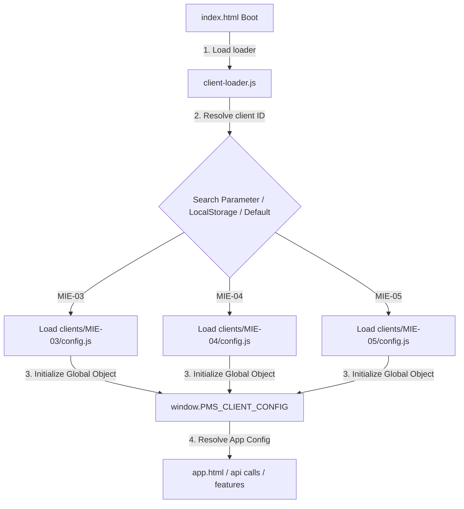

# Handover Document: POSTING MAP Deployment & Partitioning Foundation

## 1. 概要
本リポジトリは、POSTING MAP を全国 289 選挙区・支部へ展開するための「SaaS型 共通コアアプリケーション構造」への移行を完了しました。
主要ファイルや実装済みコンポーネントは、特定の地区名やIDに依存せず、設定レイヤー（Client Configurations）のみを切り離して動作する状態になっています。

---

## 2. アーキテクチャと制御フロー

---

## 3. 主要コンポーネント

### ⚙️ プロビジョニングエンジン (development/)
* **`provision-district.js`**:
  新地区用の Google Drive リソースを自動複製し、GAS 側のスクリプトプロパティを設定・デプロイし、最終的に `clients/` 配下へ個別 config.js およびマニフェストを自動書き出しします。
* **`cleanup-district.js`**:
  構築失敗時に GAS 側の API を通じて自動複製された Spreadsheet/Folder をゴミ箱へ自動移動しロールバックします。
* **`deploy-verify.js`**:
  Web App URL や ID の整合性、模擬ポスティング送信を自動テストする READY ゲート検証プログラム。

### 📂 クライアント設定レジストリ (active/dashboard/clients/)
各フォルダ内に、設定ファイルと検証マニフェストが独立して保存されます。
* **`config.js`**: LIFF ID、環境変数、GAS Web App URL、Feature Flags（機能トグルのブーリアン）を保持。
* **`deployment.json`**: プロビジョニング時刻、バージョン、検証ステータス（READY）を記録。

---

## 4. 稼働実績と検証ステータス
* **MIE-03**: 本番実運用稼働中。
* **MIE-04**: プロビジョニングテスト成功、`READY` 獲得。
* **MIE-05**: 新規自動プロビジョニング・マニフェスト/config の自動生成、および Phase 31 の 6 項目オール PASS テスト成功。
* **統合テスト**: `tests/client-loader-test.js` により、URL クエリパラメータ・LocalStorage ・デフォルトフォールバック経由での 3 クライアント切り替えおよびスキーマ構造検証の完全合格を証明済み。

---

## 5. 将来の展望（Phase 34: Multi-District Operations Foundation）
このクライアント切り分け（Configuration Partitioning）の完成により、次回は **Phase 34: Multi-District Operations Foundation** へと接続します。
* 全国規模での 289 クライアントの設定状態・デプロイバージョンを一元監視する「SaaS管理ダッシュボード（Registry Dashboard）」の構築。
* 各地区の稼働統計（アクティブユーザー数、配布率等）の横断集計（Multi-District Aggregator）。
* クライアント一括アップデート（Bulk Clasp Deployment）の自動化。
