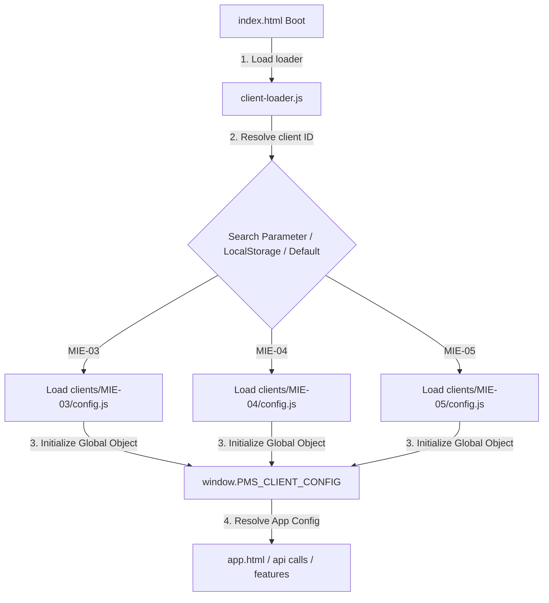
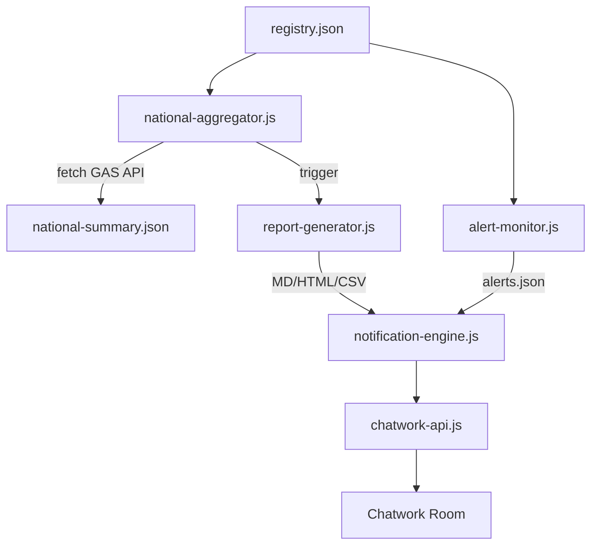

# Handover Document: POSTING MAP Foundation Phase 31–37

## 1. 概要
本リポジトリは、POSTING MAP を全国 289 選挙区・支部へ展開するための「SaaS型 共通コアアプリケーション構造」への移行を完了しました。
Phase 31（Deployment Certification）から Phase 37（Chatwork Notification Foundation）まで、7 フェーズにわたる運用基盤の構築が完了し、Foundation Freeze の条件を満たしています。

---

## 2. アーキテクチャと制御フロー

### 全体ライフサイクル
```
Deployment → Provisioning → Configuration → Operations → Analytics → Reporting → Notification
```

### クライアント設定解決フロー


### 運用データフロー


---

## 3. Phase 別 完了サマリー

### Phase 31: District Deployment Certification
- **`deploy-verify.js`**: GET/POST/Write の 3 段階ゲート検証で READY 判定を発行。
- GAS 側 Rule Engine（Spreadsheet / Drive / EventLog）と連携。

### Phase 32: District Provisioning Foundation
- **`provision-district.js`**: Drive リソース自動複製、OAuth 検証ループ、`clients/` 配下への config.js / deployment.json 自動生成。
- **`cleanup-district.js`**: 失敗時ロールバック。READY 状態の誤ロールバック防止機構付き。
- **`oauth-checker.js`**: GAS OAuth ゲートウェイブロックの自動検出。

### Phase 33: Client Configuration Partitioning
- **`client-loader.js`**: URL パラメータ → LocalStorage → デフォルト の 3 段フォールバックでクライアント設定を動的解決。
- ディレクトリトラバーサル防止のサニタイズ処理付き。

### Phase 34: Multi-District Operations Foundation
- **`registry-manager.js`**: `clients/` ディレクトリスキャンによる `registry.json` 自動再構築、重複 ID 検出、スキーマ検証。
- **`bulk-ops.js`**: 全地区への並列ヘルスチェック、一括 clasp デプロイ。`.clasp.json` の安全な復元を `finally` ブロックで保証。
- **`admin-registry.html`**: 漆黒ガラスモーフィズム UI の HQ ダッシュボード。

### Phase 35: Headquarters Operations Platform
- **`national-aggregator.js`**: 全地区 GAS API への並列 fetch で全国 KPI を集計。`national-summary.json` を生成。
- **`alert-monitor.js`**: STATE_BLOCKED / VERSION_MISMATCH / HEARTBEAT_LOST の 3 種アラートを自動検知。`alerts.json` へ出力。

### Phase 36: Automated Reporting Foundation
- **`report-generator.js`**: Markdown / HTML / CSV の 3 形式でレポートを自動生成。
- `history.json` による生成履歴管理（100 件上限自動トリム）。

### Phase 37: Chatwork Notification Foundation
- **`chatwork-api.js`**: Chatwork API ラッパー。環境変数未設定時は Mock モードへ自動フォールバック。
- **`notification-engine.js`**: アラート / レポート / プロビジョニング成功の 3 系統を統一配信。
- `notifications-history.json` による送信履歴管理（100 件上限自動トリム）。

---

## 4. 稼働実績と検証ステータス

| 地区 | ステータス | 用途 |
| :--- | :--- | :--- |
| MIE-03 | ✅ READY | 本番実運用稼働中 |
| MIE-04 | ✅ READY | プロビジョニング検証済み |
| MIE-05 | ✅ READY | 自動プロビジョニングテスト |

### テスト合格実績
| テスト | Phase | 結果 |
| :--- | :--- | :--- |
| `client-loader-test.js` | 33 | ✅ 6/6 PASS |
| `registry-integrity-test.js` | 34 | ✅ 3/3 PASS |
| `alert-monitor-test.js` | 35 | ✅ 3/3 PASS |
| `report-generator-test.js` | 36 | ✅ 4/4 PASS |
| `notification-integration-test.js` | 37 | ✅ 3/3 PASS |

---

## 5. ドキュメント一覧

### 仕様書 (docs/specifications/)
- `DistrictDeploymentFoundation.md` — Phase 31
- `DistrictProvisioningFoundation.md` — Phase 32
- `ClientPartitioningFoundation.md` — Phase 33
- `ClientConfigurationSchema.md` — Phase 33
- `MultiDistrictOperationsFoundation.md` — Phase 34
- `HeadquartersOperationsPlatform.md` — Phase 35
- `AutomatedReportingFoundation.md` — Phase 36
- `ChatworkNotificationFoundation.md` — Phase 37

### 運用ガイド (docs/operations/)
- `DeploymentGuide.md` / `ProvisioningGuide.md` / `ClientSwitchGuide.md`
- `HQOperationsGuide.md` / `NationalAnalyticsGuide.md`
- `ReportingOperationalGuide.md` / `NotificationConfigGuide.md`

---

## 6. Foundation Freeze 後の展望

Foundation Phase 31–37 の完了により、以下が確立されました:
- **認証**: 地区デプロイの品質保証ゲート
- **生成**: 1 コマンドでの新規地区開設
- **分離**: 共通コア + 地区別設定の SaaS 構造
- **運用**: 全地区の一括監視・ヘルスチェック
- **集計**: 全国 KPI のリアルタイム集約
- **報告**: 自動レポート生成（日次 / 週次 / 月次）
- **通知**: 運用イベントの Chatwork 自動配信

Product Evolution Phase では、以下が主要な対応項目となります:
1. 地区ごとの独立 Script ID / Deployment ID 割当アーキテクチャ
2. `execSync` 連鎖の非同期イベント駆動への移行
3. 地域コードマスタの外部ファイル化
4. GAS レート制限対応のバッチ分割制御
