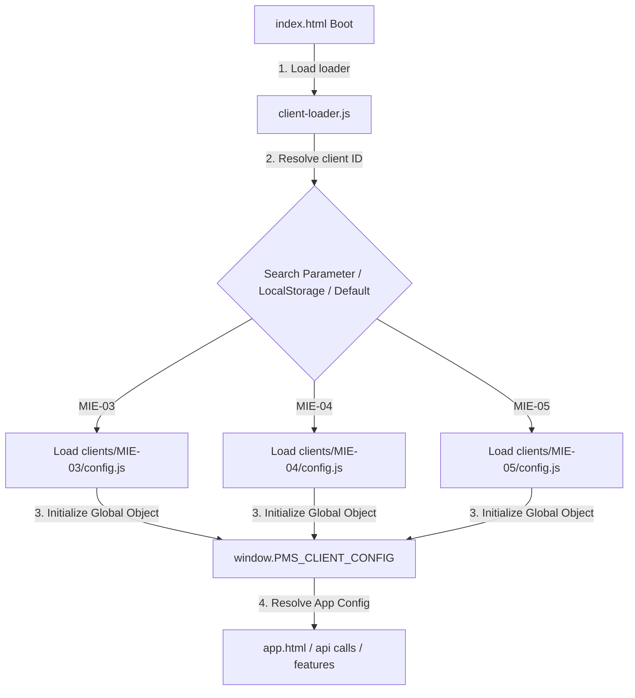
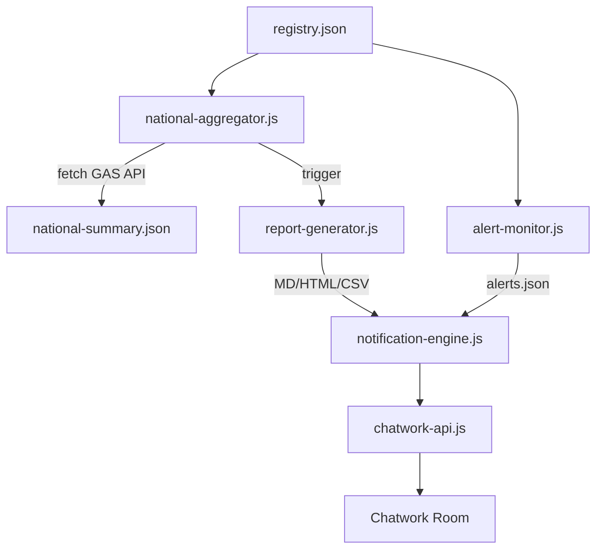

# Handover Document: POSTING MAP Foundation Phase 31–37

## 1. 概要
本リポジトリは、POSTING MAP を全国 289 選挙区・支部へ展開するための「SaaS型 共通コアアプリケーション構造」への移行を完了しました。
Phase 31（Deployment Certification）から Phase 37（Chatwork Notification Foundation）まで、7 フェーズにわたる運用基盤の構築が完了し、Foundation Freeze の条件を満たしています。

---

## 2. アーキテクチャと制御フロー

### 全体ライフサイクル
```
Deployment → Provisioning → Configuration → Operations → Analytics → Reporting → Notification
```

### クライアント設定解決フロー


### 運用データフロー


---

## 3. Phase 別 完了サマリー

### Phase 31: District Deployment Certification
- **`deploy-verify.js`**: GET/POST/Write の 3 段階ゲート検証で READY 判定を発行。
- GAS 側 Rule Engine（Spreadsheet / Drive / EventLog）と連携。

### Phase 32: District Provisioning Foundation
- **`provision-district.js`**: Drive リソース自動複製、OAuth 検証ループ、`clients/` 配下への config.js / deployment.json 自動生成。
- **`cleanup-district.js`**: 失敗時ロールバック。READY 状態の誤ロールバック防止機構付き。
- **`oauth-checker.js`**: GAS OAuth ゲートウェイブロックの自動検出。

### Phase 33: Client Configuration Partitioning
- **`client-loader.js`**: URL パラメータ → LocalStorage → デフォルト の 3 段フォールバックでクライアント設定を動的解決。
- ディレクトリトラバーサル防止のサニタイズ処理付き。

### Phase 34: Multi-District Operations Foundation
- **`registry-manager.js`**: `clients/` ディレクトリスキャンによる `registry.json` 自動再構築、重複 ID 検出、スキーマ検証。
- **`bulk-ops.js`**: 全地区への並列ヘルスチェック、一括 clasp デプロイ。`.clasp.json` の安全な復元を `finally` ブロックで保証。
- **`admin-registry.html`**: 漆黒ガラスモーフィズム UI の HQ ダッシュボード。

### Phase 35: Headquarters Operations Platform
- **`national-aggregator.js`**: 全地区 GAS API への並列 fetch で全国 KPI を集計。`national-summary.json` を生成。
- **`alert-monitor.js`**: STATE_BLOCKED / VERSION_MISMATCH / HEARTBEAT_LOST の 3 種アラートを自動検知。`alerts.json` へ出力。

### Phase 36: Automated Reporting Foundation
- **`report-generator.js`**: Markdown / HTML / CSV の 3 形式でレポートを自動生成。
- `history.json` による生成履歴管理（100 件上限自動トリム）。

### Phase 37: Chatwork Notification Foundation
- **`chatwork-api.js`**: Chatwork API ラッパー。環境変数未設定時は Mock モードへ自動フォールバック。
- **`notification-engine.js`**: アラート / レポート / プロビジョニング成功の 3 系統を統一配信。
- `notifications-history.json` による送信履歴管理（100 件上限自動トリム）。

---

## 4. 稼働実績と検証ステータス

| 地区 | ステータス | 用途 |
| :--- | :--- | :--- |
| MIE-03 | ✅ READY | 本番実運用稼働中 |
| MIE-04 | ✅ READY | プロビジョニング検証済み |
| MIE-05 | ✅ READY | 自動プロビジョニングテスト |

### テスト合格実績
| テスト | Phase | 結果 |
| :--- | :--- | :--- |
| `client-loader-test.js` | 33 | ✅ 6/6 PASS |
| `registry-integrity-test.js` | 34 | ✅ 3/3 PASS |
| `alert-monitor-test.js` | 35 | ✅ 3/3 PASS |
| `report-generator-test.js` | 36 | ✅ 4/4 PASS |
| `notification-integration-test.js` | 37 | ✅ 3/3 PASS |

---

## 5. ドキュメント一覧

### 仕様書 (docs/specifications/)
- `DistrictDeploymentFoundation.md` — Phase 31
- `DistrictProvisioningFoundation.md` — Phase 32
- `ClientPartitioningFoundation.md` — Phase 33
- `ClientConfigurationSchema.md` — Phase 33
- `MultiDistrictOperationsFoundation.md` — Phase 34
- `HeadquartersOperationsPlatform.md` — Phase 35
- `AutomatedReportingFoundation.md` — Phase 36
- `ChatworkNotificationFoundation.md` — Phase 37

### 運用ガイド (docs/operations/)
- `DeploymentGuide.md` / `ProvisioningGuide.md` / `ClientSwitchGuide.md`
- `HQOperationsGuide.md` / `NationalAnalyticsGuide.md`
- `ReportingOperationalGuide.md` / `NotificationConfigGuide.md`

---

## 6. Workspace & AIOS Order Pipeline Migration Summaries (2026-07-18 Update)

本リポジトリは、SaaS 運用の基盤整備に加え、正規の Google Drive ワークスペース構造へのバインド、および自動プロビジョニング・アクティベーションへとつながる AIOS 注文パイプラインの結合を完了しました。

### 6.1. Google Drive Workspace & Master Reference Migration
* **`AssetRegistry` / `AssetRegistryService` の確立**: 
  - `FIELD_OPERATIONS_PLATFORM/` (ID: `1FfcVEQjod--rZSucOPFJD2DJ58hV650_`) を本番 single source of truth とし、配下の 8大サブフォルダとアセット ID の完全な紐付けを自動化。
  - `masters.global` および `masters.districts` の拡張階層スキーマを導入。
* **Master Reference CSV 資産化**:
  - `Address/` および `Postal/` サブフォルダを Drive 上に新規作成。
  - 郵便番号マスター (`KEN_ALL.CSV`) および全国住所マスター (`postal.csv`) をバイナリセーフでアップロード。
  - SHA-256 ハッシュ（チェックサム）、バージョン (`2026-07`)、データソース情報をメタデータとして AssetRegistry に登録し、AIOS が自動検索・参照可能に設定。

### 6.2. AIOS Order-to-Branch Automation Pipeline (Sprint 1 ~ 4)
* **Order-to-Research Foundation**:
  - 注文受付オーケストレータ `OrderRuntime.ts` と `MissionCreator.ts` を実装。
  - 注文（東京第18区等）を元に Research Agent を起動し、内包する基礎自治体リストを抽出して `research-result.json` を出力するフローを自動化。
* **Data Builder Foundation**:
  - `RESEARCH_COMPLETED` イベント駆動によって非同期起動する `DataBuilderRuntime.ts` を実装。
  - `district.json` （市町村オブジェクト配列構造）と `config.json` を自動生成。
  - 地図 of 初期中心座標決定（`map.center: null`）や世帯数・配布目標の設定を Data Builder の責務から除外し、意思決定を伴わない純粋な「初期メタデータコンパイラ」として実装。
* **Provisioning Runtime Foundation**:
  - `DATA_BUILD_COMPLETED` イベントをフックして非同期起動する `ProvisioningRuntime.ts` を実装。
  - Google Drive 連携部 `AssetCloner.ts` を介してスプレッドシートのクローンコピー、およびブランチ専用 Storage フォルダの作成を自動実行。
  - 異常発生時は `FAILED` に遷移し、作成中だった複製ファイルを自動検知して削除する自動ロールバック機能（`ProvisioningStateMachine`）を実装。
  - クローン完了の READY 段階で初めて `AssetRegistry.json` への一括書き込みを行い、環境設定ファイル `deployment.json` (nested `gas` schema) をブランチフォルダへ出力。
* **Runtime Activation Foundation**:
  - `PROVISIONING_COMPLETED` イベントフックにより非同期起動する `ActivationRuntime.ts` を実装。
  - `LineConnector.ts` による共通 LINE インフラ（Login / Msg / Admin）の 20 文字制限適合性および存在チェックを実行。
  - `GasConnector.ts` による、フラット・ネスト双方に対応した GAS WebApp API の疎通ヘルスチェックを自動検証。
  - `ActivationVerifier.ts` により、レジストリバインドと Dashboard 接続パラメータの整合性を検証。
  - 検証フローに `AUDIT_VERIFYING` 状態を追加し、成功時に `runtime` メタデータ、各チェック PASS 状態、監査トランザクションを格納した `activation.json` を出力して `ACTIVE` 状態へ確定。

---

## 7. 追加テスト合格実績

| テスト | 対象フェーズ | 結果 |
| :--- | :--- | :--- |
| `asset-registry-integrity-test.js` | Registry / Masters | ✅ 5/5 PASS |
| `test_order_flow.ts` | Order-to-Research | ✅ 1/1 PASS |
| `test_data_builder_flow.ts` | Data Builder | ✅ 1/1 PASS |
| `test_provisioning_flow.ts` | Provisioning Runtime | ✅ 1/1 PASS |
| `test_activation_flow.ts` | Activation Runtime | ✅ 1/1 PASS |

※プロジェクト全体の TypeScript 統合テストを含む **140 個のテストすべてがノーエラー（0 failures）でグリーンパス（PASS）**しています。
