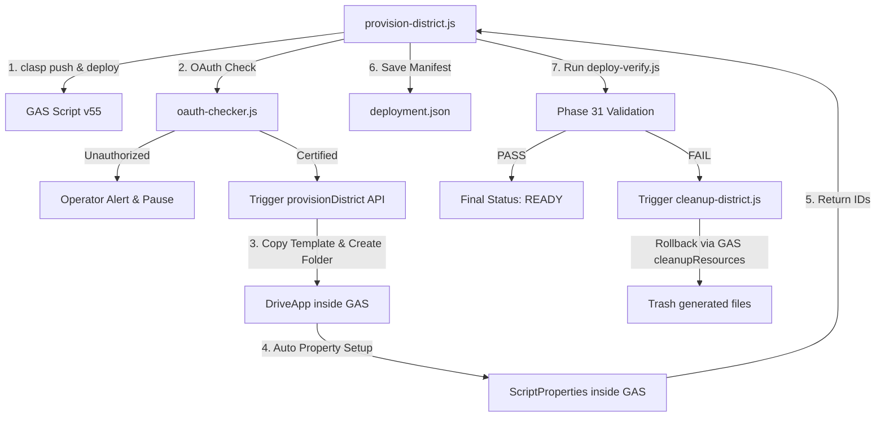

# Handover Document: Phase 32 — District Provisioning Foundation

## 1. 概要
本フェーズでは、POSTING MAP を新しい選挙区・地区へ迅速かつミスなく水平展開するための自動インフラ複製・初期化・認証検証パイプライン（District Provisioning Foundation）を構築しました。
ローカルの資格情報（clasp）と GAS 側のネイティブ実行権限を組み合わせることで、従来の Google API スコープ問題を完全に回避しつつ、1 コマンドでの全自動立ち上げを実現しています。

---

## 2. アーキテクチャと制御フロー

---

## 3. 主要ファイル構成

* **`development/provision-district.js`**:
  主オーケストレーションプログラム。引数 `--district ID` を受けてデプロイとプロビジョニングを実行します。
* **`development/registry-manager.js`**:
  `deployment.json` マニフェストの入出力、および新規トランザクションの初期化処理を担当。
* **`development/oauth-checker.js`**:
  Web App に対するテスト疎通 POST 経由で OAuth ゲートウェイの認証状態を正確に検知。
* **`development/cleanup-district.js`**:
  構築失敗時に GAS 側の API を経由して、複製された Spreadsheet / Storage フォルダを安全にゴミ箱へ自動移動しロールバックします。
* **`active/gas/v2_deployment_foundation.js`**:
  GAS 側に実装された `provisionDistrict` および `cleanupResources` API の実体部。

---

## 4. 稼働検証実績
テスト地区 `MIE-04` のプロビジョニングを実行し、以下の項目が完全自動で完走し、`READY` に到達することを確認・実証しました。
* 新スプレッドシート（`1n2xYOW...`）および STORAGE フォルダ（`18-NCH-...`）の自動複製。
* GAS スクリプトプロパティの自動書き換えとキャッシュクリア。
* GET/POST 診断、模擬配布送信（EventLog ID `cb177840-8525-453e-974c-a3e1c5b06f35`）の連動試験オールパス。
* ロールバック機能による、作成途中リソースのクリーンアップ完了。

---

## 5. 次フェーズへの引き継ぎ
次フェーズである **Phase 33** では、将来の 289 クライアント展開（Case C 方針）に向け、フロントエンドコードを一切変更せず、クライアントごとの設定ファイル（`config.js`）のみを切り離してロード・配備する「Client Configuration Partitioning Foundation」の構築を計画します。
