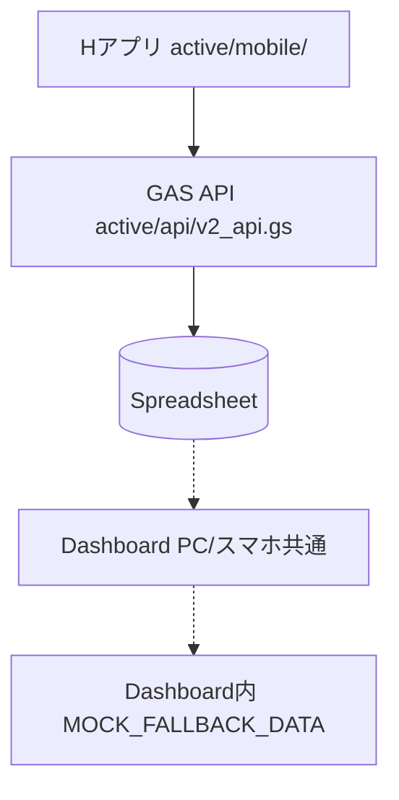

# POSTING MAP FULL AUDIT REPORT
**(POSTING MAP Version 1.0 開発前 全体資産監査)**

本レポートは、POSTING MAP を Version 1.0 製品として完成させるための既存資産の棚卸しと現状把握を目的とした監査報告書です。設計変更・コード修正は含まれていません。

---

## 1. 全体構造評価
- **`active/`**: 現在稼働中の中心ディレクトリ。Hアプリ (`mobile/`)、Dashboard (`dashboard/`)、GASバックエンド (`gas/`, `api/`) が格納されています。
- **`src/`**: 完成したAIOS (Generation 6 Runtime Foundation) のソースコード。POSTING MAP はこれを「必要な箇所のみ」OSとして利用します。

**確認対象資産**
- `operations/`（旧Kアプリモック）
- `field/`（旧Hアプリ）
- `dashboard/`（旧Dashboard）
※ Version 1.0開発の中で利用有無を確認し、不要と判断された資産は段階的に整理します。

## 2. 現状アーキテクチャ
現在のデータフローであり、**これを製品として完成させることが最優先事項**です。

## 3. Dashboard資産一覧
PC・スマートフォン双方に対応する唯一の管理画面です。
- **ディレクトリ**: `active/dashboard/` (主), `dashboard/` (従・確認対象)
- **UI**: TailwindCSSによるレスポンシブ対応（漆黒UI）。
- **最優先課題 (MOCK排除)**: 現状は `DashboardDataAdapter.js` 等で `MOCK_FALLBACK_DATA` が利用されており、GAS APIからの実データ接続への切り替えが必要です。

## 4. Hアプリ資産一覧
現場の配布員用アプリ (LIFF)。
- **ディレクトリ**: `active/mobile/`
- **機能**: LINE LIFFログイン、GPS取得、写真撮影、配布報告。
- **最優先課題**: 実データでのGAS通信確認、Spreadsheet更新確認のフローを確立すること。

## 5. GAS資産一覧
- **中核ファイル**: `active/api/v2_api.gs` (4177行)、`active/gas/05_field.gs` (3097行)
- **課題 (God Class)**: 巨大なモノリスファイルが存在します。製品安定稼働後に、機能分割・モジュール化が必要です。

## 6. Spreadsheet資産一覧
正常運用を最優先とすべきデータベース・ログです。
- **マスター・管理**: `SHEET_ROSTER`, `SHEET_ADMIN`, `SHEET_TEMPLATE`
- **トランザクション・ログ**: `EVENTLOG`, `EVENT_QUEUE`
- **最優先課題**: AIOS Ledger化などの将来構想よりも、まずは Spreadsheet ベースでの正常運用・安定稼働を確保します。

## 7. AIOS統合候補一覧
POSTING MAP Version 1.0 完成後、**実運用で必要になった機能のみ** AIOS Runtime を順次導入します。

**AIOS導入優先順位**
- **Priority 1: Monitoring** (稼働後の可観測性向上)
- **Priority 2: Ledger** (Spreadsheetの限界が見えた後の永続化手段)
- **Priority 3: Event Bus** (高度なリアルタイム同期が必要になった段階で導入)
- **Priority 4: Trust** (将来の高度な権限管理用)

## 8. 技術的負債一覧
| 負債の種類 | 該当箇所 | 優先順位 |
|---|---|---|
| **MOCK残存** | ダッシュボード内のフォールバックデータ | P0 |
| **重複コード** | `dashboard/` vs `active/dashboard/` | P1 |
| **Dead Code疑い** | `operations/`, `field/` | P1 |
| **巨大ファイル** | `v2_api.gs`, `05_field.gs` | P2 |

## 9. Version 1.0 開発優先順位
POSTING MAP Version 1.0 の最優先課題は、AIOSとの高度な統合ではなく、**「現場で使える製品として完成させること」**です。データフローの始点から終点へ向けて以下の順に解決します。

| 優先度 | フェーズ | 実行内容 |
|---|---|---|
| **P0-1** | **製品を動かす** | Hアプリ → GAS 通信確認 |
| **P0-2** | | Spreadsheet 更新確認 |
| **P0-3** | | Dashboard が実データ取得 |
| **P0-4** | | Mock 完全撤去 |
| **P0-5** | | スマホ Dashboard 最終調整 |
| **P1** | **資産整理** | dashboard重複、field重複、operations確認、legacy整理 |
| **P2** | **GAS整理** | God Class分割、API整理、モジュール化 |
| **P3** | **AIOS連携** | ここで初めて実運用で必要になった機能を順次導入 |

---

## 開発方針

POSTING MAP Version 1.0 は、

**「完成したAIOSを利用する最初の製品」**

として開発を進める。

AIOSの利用は目的ではなく、

**POSTING MAPの完成と現場運用を最優先とする。**

AIOS Runtime は、

**実運用で必要になった機能のみ段階的に導入する。**

今日から主役はPOSTING MAPである。
AIOSは「開発対象」ではなく、「支える基盤」として機能する。

---

## Version 1.0 リリース判定

以下をすべて満たした場合、POSTING MAP Version 1.0 を正式リリースとする。

- [ ] Hアプリから実データが送信できる
- [ ] GAS APIが正常動作する
- [ ] Spreadsheetへ正常保存される
- [ ] Dashboardが実データのみで表示される
- [ ] DashboardがPC・スマートフォン双方で正常動作する
- [ ] Mockデータが完全撤去されている
- [ ] 実運用テストを完了している
- [ ] 重大障害（Critical）が存在しない
- [ ] 運用開始後、重大障害なく一定期間（例：数日～1週間）の安定稼働を確認している

完成後、Version 1.1以降で必要なAIOS Runtime機能を段階的に導入する。
