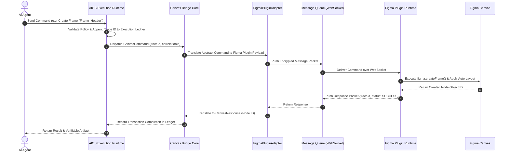

# Execution Sequence Diagram (Phase 3)

本ドキュメントは、AIOS Execution Runtime を流れる **Canvas Automation Platform 実行シーケンス図** である。

---

## 🔄 End-to-End Sequence Flow

```mermaid
sequenceDiagram
    autonumber
    actor AI as AI Agent
    participant Runtime as AIOS Execution Runtime
    participant Bridge as Canvas Bridge Core
    participant Adapter as FigmaPluginAdapter
    participant Queue as Message Queue (WebSocket)
    participant Plugin as Figma Plugin Runtime
    participant Canvas as Figma Canvas

    AI->>Runtime: Send Command (e.g. Create Frame "Frame_Header")
    Runtime->>Runtime: Validate Policy & Append Trace ID to Execution Ledger
    Runtime->>Bridge: Dispatch CanvasCommand (traceId, correlationId)
    Bridge->>Adapter: Translate Abstract Command to Figma Plugin Payload
    Adapter->>Queue: Push Encrypted Message Packet
    Queue->>Plugin: Deliver Command over WebSocket
    Plugin->>Canvas: Execute figma.createFrame() & Apply Auto Layout
    Canvas-->>Plugin: Return Created Node Object ID
    Plugin-->>Queue: Push Response Packet (traceId, status: SUCCESS)
    Queue-->>Adapter: Return Response
    Adapter-->>Bridge: Translate to CanvasResponse (Node ID)
    Bridge-->>Runtime: Record Transaction Completion in Ledger
    Runtime-->>AI: Return Result & Verifiable Artifact
```
