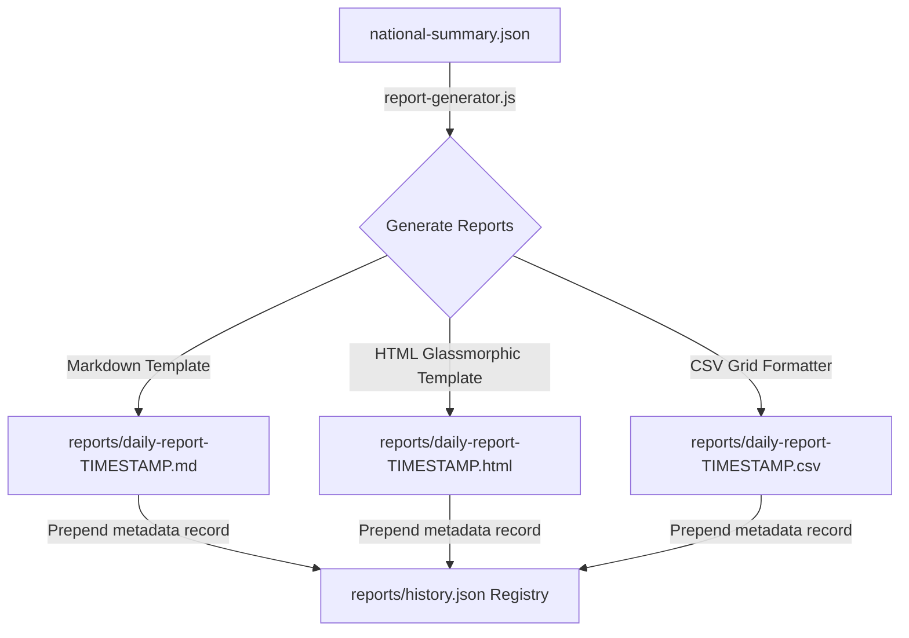

# Specification: Automated Reporting Foundation

本仕様書は、全国 289 選挙区の集約進捗から日次・週次・月次の活動報告レポートを自動生成する「Automated Reporting Foundation」のファイル構造、テンプレート仕様、および履歴メタデータ（`history.json`）スキーマを定義します。

---

## 1. Engine Architecture

本エンジンは、集計済みの `national-summary.json` をロードし、異なる利用チャネルに適した 3 つのフォーマット（Markdown / HTML / CSV）にコンパイルして出力します。



---

## 2. Output Format Specifications

### 2.1. Markdown (.md)
* **目的**: チャット（Chatwork等）へそのままコピペ投稿できるコンパクトな表付きテキスト。
* **構造**: ヘッダー（合計値、稼働地区数、平均進捗） ＋ 地域別集計テーブル ＋ 選挙区別リーダーボード。

### 2.2. HTML (.html)
* **目的**: 本部メール配信用、またはダッシュボードから直接開いて確認できるリッチなグラフィカルレポート。
* **デザイン美学**: 黒背景、微発光インジケーター、角丸20px以上のガラスモーフィズムカード。

### 2.3. CSV (.csv)
* **目的**: 外部分析（Excel、Spreadsheets）に流し込み可能な構造化データ。
* **ヘッダー**: `DistrictId,DistrictName,TotalAreas,CompletedAreas,ProgressAvg`

---

## 3. Audit History Registry Schema (history.json)

`reports/history.json` は、生成されたすべてのレポートアセットの履歴を記録するメタデータ台帳です。Notification Engine（Phase 37）の自動送信キューのインプットとして使用されます。

```json
{
  "schemaVersion": 1,
  "history": [
    {
      "type": "daily",
      "timestamp": 1784352898138,
      "files": {
        "markdown": "clients/reports/daily-report-1784352898138.md",
        "csv": "clients/reports/daily-report-1784352898138.csv",
        "html": "clients/reports/daily-report-1784352898138.html"
      }
    }
  ]
}
```
* **制限ルール**: `history` 配列はスタック型キューとして制御され、最大 100 件の履歴レコードを保持し、それを超えた古いレコードは自動でトリム（削除）されます。
