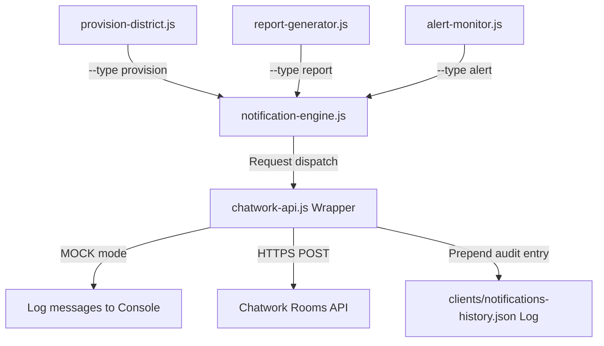

# Specification: Chatwork Notification Foundation

本仕様書は、データ収集・集計・アラート・プロビジョニング完了などの各種運用イベントを現場チャットへリアルタイムに配信する「Chatwork Notification Foundation」の API 接続仕様、メッセージテンプレート設計、および通知履歴（`notifications-history.json`）のデータ構造を定義します。

---

## 1. System Integration Flow

通知システムは、各処理スクリプト（集計・プロビショニング・監視）の最終ステップから子プロセスとして起動され、API ラッパーを介して Chatwork へ暗号化送信されます。



---

## 2. API Configuration & Wrapper Protocol

### 2.1. 環境変数設定
* `CHATWORK_API_TOKEN`: Chatwork API にアクセスするための専用トークン。
* `CHATWORK_ROOM_ID`: メッセージが投稿される送信先チャットルームID。
* *※ どちらか一方でも環境変数が未設定、あるいは TOKEN が `mock` の場合、自動的に Mock モードにフォールバックし、チャット送信をコンソールログ出力として擬似実行します。これにより、インターネット接続やトークン設定のないローカル環境でのテスト整合性を担保します。*

---

## 3. Message Format Templates

Chatwork 専用の装飾タグ（`[info]`, `[title]`, `[code]`）を使用し、視認性の高い通知を行います。

### 3.1. Report Deliveries
```text
[info][title]📋 POSTING MAP REPORT[/title]
# POSTING MAP DAILY PERFORMANCE REPORT
* Generated At: 2026-07-18 14:41:28
* Active Districts: 3 / 3
...
[/info]
```

### 3.2. Urgent Alerts
```text
[info][title]🚨 POSTING MAP HQ OPERATIONAL ALERTS[/title]
1. [CRITICAL] MIE-05
   Heartbeat lost for MIE-05. Last communication was 2026/07/17 14:00:00.
[/info]
```

---

## 4. Notifications Audit Schema (notifications-history.json)

`clients/notifications-history.json` に記録されるオブジェクトスキーマ：

```json
{
  "schemaVersion": 1,
  "history": [
    {
      "type": "report",
      "timestamp": 1784353288840,
      "status": "SUCCESS",
      "contentPreview": "[info][title]📋 POSTING MAP REPORT[/title]...",
      "response": {
        "success": true,
        "messageId": "mock-msg-1784353288840"
      }
    }
  ]
}
```
* **キュー制限**: 過去の送信通知履歴は最大 100 件に制限され、それを超えた古い履歴レコードは自動でトリムされます。
