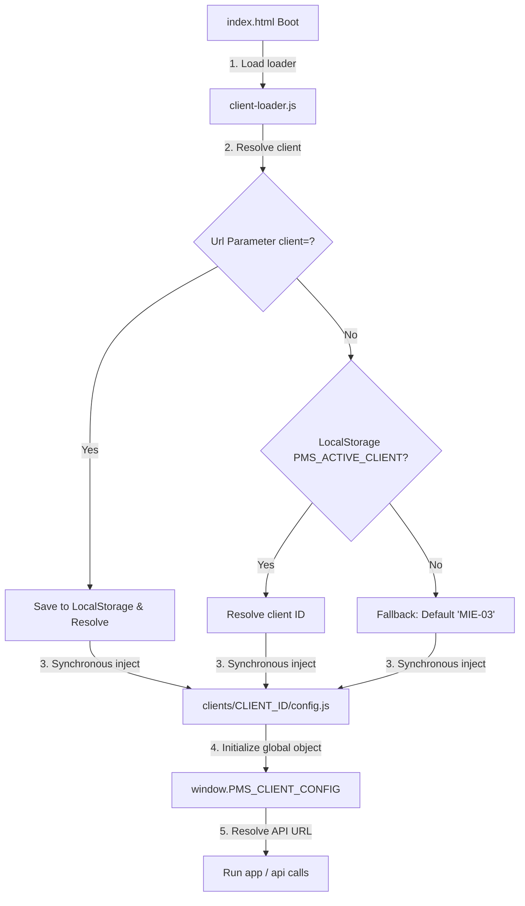

# Specification: Client Configuration Partitioning Foundation

本仕様書は、POSTING MAP を全国 289 選挙区・支部へ水平展開するにあたり、フロントエンドのコアソースコードを単一（シングルソース）に維持したまま、クライアントごとの設定を安全に切り分ける「Client Configuration Partitioning Foundation」の設計仕様を定義します。

---

## 1. Loader Architecture (クエリ ➔ ローカルキャッシュ ➔ フォールバック)

ローコードで動作する PWA フロントエンドにおいて、ビルド書き換えによるデプロイミスを防ぐため、`client-loader.js` を用いた動的解決（ランタイムバインド）構造を採用します。



* **同期インジェクション**: `document.write` を用いて同期的に `<script>` タグを動的挿入することで、ブラウザが `index.html` 内のメインスクリプト（インライン script / app.js 等）を実行する前に、確実にグローバル設定変数 `window.PMS_CLIENT_CONFIG` が初期化されている状態を保証します。

---

## 2. Client Folder Structure (レジストリ)

各クライアント情報および検証マニフェストは、`active/dashboard/clients/` ディレクトリ配下に、地区 ID を名前にしたフォルダを作成して格納します。

```
active/dashboard/clients/
├── MIE-03/
│   ├── config.js         <-- クライアント設定ファイル
│   └── deployment.json   <-- 構築/検証証明マニフェスト
└── MIE-04/
    ├── config.js
    └── deployment.json
```

この構造により、開発時や本番運用時に設定アセットを切り替える際にも、コアなHTML・CSS・UI JSコードの変更差分は一切発生せず、設定フォルダの追加・削除のみでクライアントを管理可能です。
