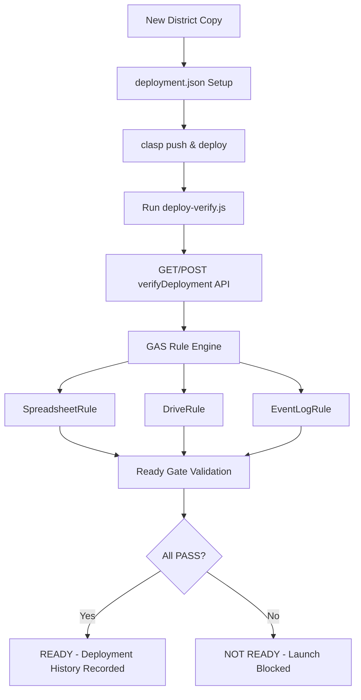

# Specification: District Deployment Foundation

POSTING MAP を新しい選挙区（支部・地区）へ安全かつスケール可能に水平展開するための、デプロイ検証・認証エンジン（Deployment Foundation）の設計仕様書。

---

## 1. Architecture Overview

本システムは、GAS 側のルール検証エンジンと、ローカル（CI/CD または展開管理スクリプト）で稼働する認証エンジンの 2 層構造で動作します。



---

## 2. Key Components

### 2.1. Deployment Manifest (`deployment.json`)
地区ごとのデプロイ構成を静的に宣言します。スクリプトプロパティだけに依存せず、宣言的設定として扱います。

* **district**: 地区識別名 (e.g. `MIE-03`)
* **spreadsheetId**: 連携先スプレッドシートの物理 ID
* **storageFolderId**: 写真保存先 Google ドライブフォルダの物理 ID
* **scriptId**: Apps Script プロジェクト ID
* **webAppUrl**: 本番 Web App URL

### 2.2. Verification Result Model
GAS および検証クライアントの通信で利用される構造化ステータスモデル。
```typescript
interface VerificationResult {
  name: string;      // 検証ルール名 (e.g. "Spreadsheet Access")
  status: string;    // "PASS" | "WARNING" | "FAILED" | "SKIPPED"
  message: string;   // 詳細メッセージ、エラー詳細
  timestamp: number; // 実行日時エポックミリ秒
}
```

### 2.3. Rule Engine (`VerificationRule`)
各診断項目をモジュール化された `VerificationRule` インスタンスとして実装し、順次パイプライン実行します。

| ルールクラス名 | 対象領域 | 合格基準 |
| :--- | :--- | :--- |
| **SpreadsheetRule** | Google スプレッドシート | 正常に `openById()` が通り、シート名のリストが 1 つ以上取得できること。 |
| **DriveRule** | Google ドライブフォルダ | `STORAGE_PARENT_ID` からフォルダーオブジェクトを解決できること。 |
| **EventLogRule** | 監査ログシート | `EventLog` シートが存在し、正しいヘッダー定義（12カラム）で構成されていること。 |

### 2.4. WebApp Certification & Ready Gate
デプロイ後、検証ツール `deploy-verify.js` が以下の 3 ステップを外部から叩くことで最終稼働判定（Ready Gate）を行います。

1. **GET Diagnostics**: GAS ルールエンジンの結果を取得
2. **POST Diagnostics**: OAuth 認証ブロックが発生しないことの確認
3. **Simulated H-App POST**: 実際の `submitDistribution` と同様の擬似データを送信し、スプレッドシート書き込みと EventLog 追記が正常完走し JSON が返ることを確認
