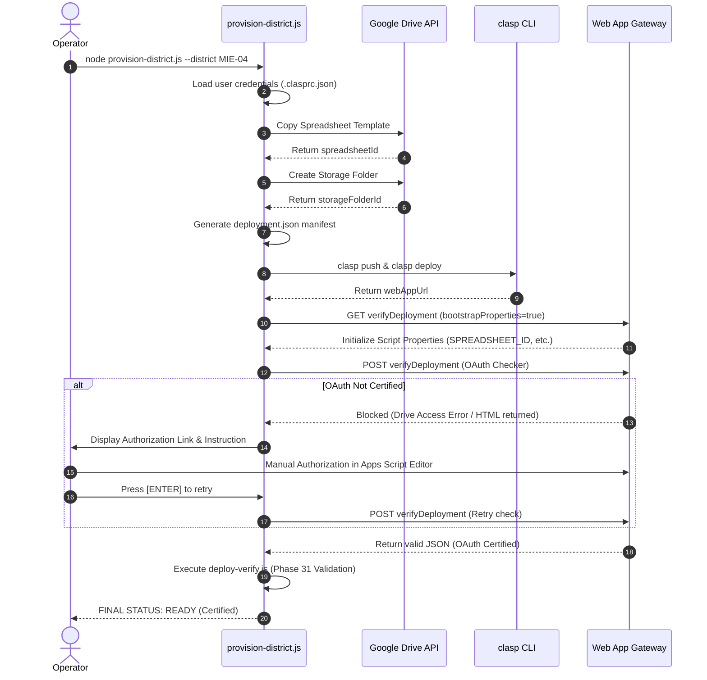

# Specification: District Provisioning Foundation

本仕様書は、POSTING MAP を新しい地区へ安全・迅速に水平展開するための、自動リソース構築・マニフェスト生成・デプロイパイプライン（District Provisioning Foundation）の技術仕様を定義します。

---

## 1. Sequence & Architecture Flow

プロビジョニングプロセスは、ローカル CLI から実行され、以下の手順で進みます。

---

## 2. Component Details

### 2.1. Provisioning CLI Suite
役割を単一のスクリプトに詰め込むのではなく、モジュール化して責務分離を図ります。
* **`provision-district.js`**: 全体のオーケストレーションを司る主プロキシツール。
* **`registry-manager.js`**: `deployment.json` のロード、更新、メタデータ保存の管理。
* **`oauth-checker.js`**: デプロイされた Web App の OAuth ゲートウェイ認証状態の成否チェック。
* **`cleanup-district.js`**: 構築失敗時の Drive ファイル／フォルダの自動ロールバック削除。

### 2.2. Transaction & Rollback
構築途中の失敗（GASデプロイ失敗など）により中途半端な複製リソースがドライブ上に残留するのを防ぐため、以下のトランザクション管理を行います。
* コマンド実行時に `prov-[Timestamp]-[DistrictID]` のトランザクションIDを発行。
* 失敗をキャッチした場合、`cleanup-district.js` が呼び出され、マニフェストに記録されたリソース（Spreadsheet, Folder）を Google Drive API 経由で即時に自動削除し、マニフェストのステータスを `ROLLED_BACK` に更新して終了します。

### 2.3. Google User Credentials Authentication
`googleapis` 等の複雑な認証鍵ファイル（Service Account Key）の持ち回りによるセキュリティ事故を避けるため、ローカルで `clasp login` された運用アカウント `postingareamap@gmail.com` の `~/.clasprc.json` から `access_token` を吸い出し、それを用いて Google Drive REST API を認証・操作する「運用一致認証方式」を採用します。
