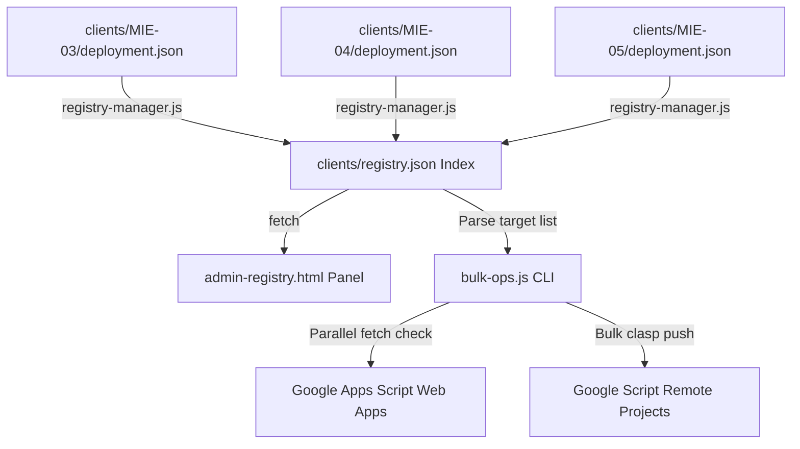

# Specification: Multi-District Operations Foundation

本仕様書は、全国 289 選挙区・支部に水平展開された POSTING MAP の運用監視・一括アップデート・ハートビート診断を行う「Multi-District Operations Foundation」のシステム設計およびインターフェース仕様を定義します。

---

## 1. System Architecture

本システムは、各地区フォルダに分散されたマニフェスト（`clients/*/deployment.json`）を Single Source of Truth（唯一の事実情報源）とし、それらを集約したインデックスファイル `registry.json` をハブとする構造を採用しています。



---

## 2. Command Line Operations (bulk-ops.js)

### 2.1. Parallel Health Check Queue
* コマンド: `node development/bulk-ops.js --action health`
* 動作:
  1. `registry.json` 内に登録されたすべての地区の Web App 接続先 URL をロード。
  2. 非同期で並列に `verifyDeployment` HTTP リクエストを送信。
  3. 各地区のレスポンスタイム（Latency）、GAS 側の実行バージョン、診断結果（PASS/WARNING/BLOCKED）を検知。
  4. コンソール上に Markdown 表形式でレポートを出力し、同時に `registry.json` に最新のヘルス情報（`lastHeartbeat`, `latency`）をマージ・保存します。

### 2.2. Automated Bulk clasp Deployment
* コマンド: `node development/bulk-ops.js --action deploy`
* 動作:
  1. マニフェストから `status: READY` の地区のみを自動抽出。
  2. `clasp` の設定ファイル `.clasp.json` の `scriptId` フィールドを各地区の Script ID に動的に書き換える。
  3. 順次、`clasp push` ➔ `clasp deploy -i [DeploymentID]` を自動実行して最新コードを安全に一括適用。
  4. 完了後、元の開発用 `.clasp.json` 構成を自動復元。

---

## 3. Data Integration Registry Schema

`registry.json` は、ダッシュボードおよび CLI ツール共通のスキーマ構造を保ちます。

```json
{
  "updatedAt": 1784352379826,
  "schemaVersion": 1,
  "districts": [
    {
      "id": "MIE-03",
      "name": "三重県第3区",
      "status": "READY",
      "deployment": {
        "version": 61,
        "environment": "production"
      },
      "runtime": {
        "latency": 138,
        "lastHeartbeat": "2026-07-18T05:25:29.117Z",
        "lastCertification": "2026-07-18T02:35:56Z"
      },
      "resources": {
        "spreadsheetId": "...",
        "webAppUrl": "...",
        "scriptId": "..."
      }
    }
  ]
}
```
